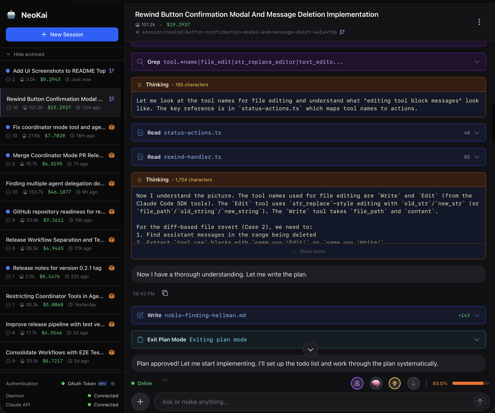
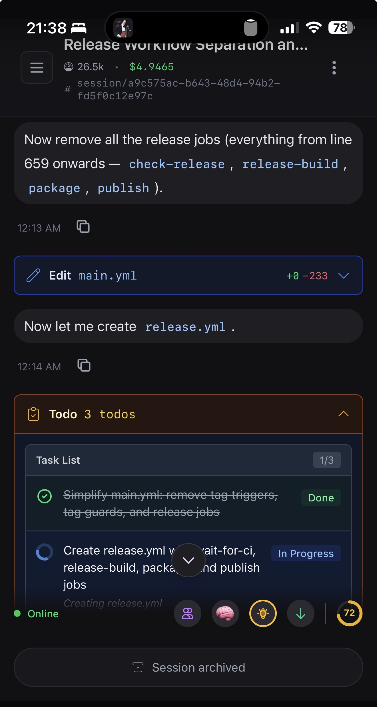

# NeoKai

[](https://github.com/lsm/neokai/actions/workflows/main.yml)
[](https://codecov.io/gh/lsm/neokai)

Claude Code web UI for coding, life, and anything in between.

## Screenshots

<table>
  <tr>
    <td></td>
    <td></td>
  </tr>
</table>

<p align="center">
  <em>Desktop and mobile interfaces showing coordinator mode with multi-agent workflow and task management</em>
</p>

Run `kai` in any directory to get a full-featured web interface for Claude right in your browser. Manage multiple conversations at once, switch models on the fly, and let the agent read, write, and run code in your project — all from a clean, responsive UI.

## Quick start

```bash
npm install -g neokai
export ANTHROPIC_API_KEY=sk-ant-...
kai
```

Open `http://localhost:9283` and start a conversation.

## Features

- **Multi-session conversations** — run multiple independent agent sessions side by side
- **Model switching** — swap between Sonnet, Opus, and Haiku mid-conversation
- **File and git operations** — the agent reads, writes, and commits within your workspace
- **MCP server support** — connect external tools via the Model Context Protocol
- **Rewind and checkpoints** — roll back file changes or conversation history to any point
- **Extended thinking** — enable thinking mode with configurable token budgets (8k/16k/32k)
- **macOS and Linux** — native binaries for darwin-arm64, darwin-x64, linux-x64, and linux-arm64

## Authentication

Set one of these environment variables before starting:

| Variable | Description |
|----------|-------------|
| `ANTHROPIC_API_KEY` | Anthropic API key (recommended) |
| `CLAUDE_CODE_OAUTH_TOKEN` | OAuth token from Claude Code |

## Usage

```
kai [path] [options]
```

| Option | Default | Description |
|--------|---------|-------------|
| `path` | `.` | Workspace directory |
| `-p, --port` | `9283` | Port to listen on |
| `--host` | `0.0.0.0` | Host to bind to |
| `--db-path` | `./data/daemon.db` | Database location |
| `-V, --version` | | Show version number |

## Development

This project uses a `dev` branch for active development. See [CONTRIBUTING.md](CONTRIBUTING.md) for details on the branching strategy and contribution guidelines.

Quick overview:
- All feature PRs should target the `dev` branch for faster CI feedback (E2E tests skipped)
- E2E tests run automatically when changes are merged to `dev`
- PRs from `dev` to `main` run full test suite for production deployment

## License

[Apache-2.0](LICENSE)
