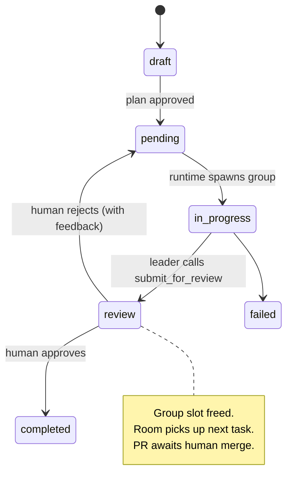
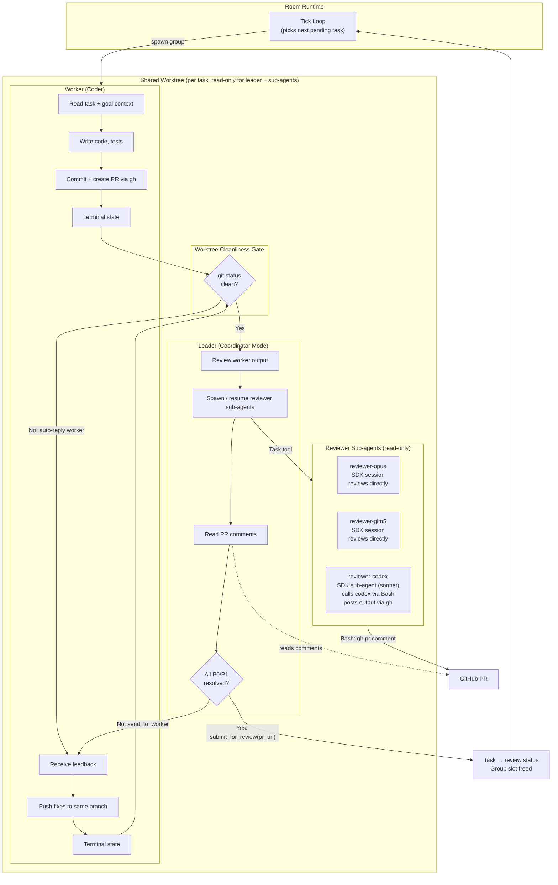
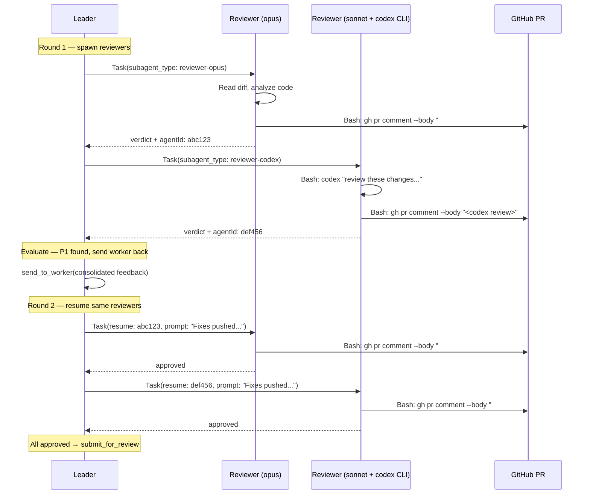

# PR Review Workflow - Design

## Overview

Automate the GitHub PR + multi-round AI peer review workflow within room autonomous execution.
The coding agent creates a PR, the leader (as coordinator) spawns reviewer sub-agents from
different models/providers, iterates until all blocking findings are resolved, then parks the
task for human approval while the room moves on to the next task.

## Task Lifecycle



## Worker → Leader → Reviewer Flow



## Reviewer Sub-agent Detail

The leader uses the coordinator's Task tool to spawn reviewer sub-agents. On subsequent
rounds, the leader is instructed to use `Task(resume: agentId)` to continue each reviewer's
session with full prior context preserved. This is the leader's choice — we just describe the
behavior in its system prompt.



---

## Implementation Plan

### Change 1: Add `review` task status, remove `escalated`

Simplify task states to: `draft | pending | in_progress | review | completed | failed`.

Remove `escalated` — it's a vague middle ground. If the leader can't resolve something,
it fails the task. If work is done and needs human eyes, it goes to `review`.

Also remove `awaiting_human` from `GroupState` and the escalation logic
(nudge-then-escalate on leader contract violation → just fail instead).

**Files:**
- `packages/shared/src/types/neo.ts` — update `TaskStatus` union
- `packages/daemon/src/storage/schema/index.ts` — update CHECK constraint
- `packages/daemon/src/storage/schema/migrations.ts` — migration
- `packages/daemon/src/lib/room/task-manager.ts` — add `reviewTask()`, remove
  `escalateTask()` / `deescalateTask()`
- `packages/daemon/src/lib/room/room-runtime.ts` — remove escalation logic, leader
  contract violation → fail instead of escalate. `review` tasks don't trigger replanning.
- `packages/daemon/src/lib/room/session-group-repository.ts` — remove `awaiting_human`
  from `GroupState`
- `packages/web/` — UI badge/color for review status, remove escalated references

### Change 2: Worktree cleanliness gate

Before routing worker output to leader, check `git status` in the worktree. If there are
uncommitted changes or untracked files, auto-reply the worker instead of forwarding to leader:
"Make logical commits for changes you want to keep and clean up unused files."

This ensures the leader and reviewers always see a clean, committed state.

**Files:**
- `packages/daemon/src/lib/room/room-runtime.ts` — in `onWorkerTerminalState()`, before
  `routeWorkerToLeader()`, run `git status --porcelain` in the worktree. If non-empty,
  inject message back to worker and keep group in `awaiting_worker` state.

### Change 3: Add `submit_for_review` leader tool

New terminal tool for the leader. When called, it completes the group, transitions the task
to `review` status, and records the PR URL on the task.

**Files:**
- `packages/daemon/src/lib/room/leader-agent.ts` — add tool definition + prompt section
- `packages/daemon/src/lib/room/room-runtime.ts` — handle in `handleLeaderTool()`
- `packages/daemon/src/lib/room/task-group-manager.ts` — add `submitForReview()` method

### Change 4: Enable coordinator mode on leader

The leader session gets coordinator mode with room-configured reviewer sub-agents.
Each reviewer is an `AgentDefinition` with a model, restricted tools (Read, Grep, Glob,
Bash for `gh`), and a reviewer prompt. For CLI-only models, the sub-agent uses sonnet
and calls the CLI via Bash.

**Files:**
- `packages/daemon/src/lib/room/leader-agent.ts` — set `coordinatorMode: true`, build
  reviewer `AgentDefinition` records from `Room.config.reviewers`
- `packages/daemon/src/lib/agent/query-options-builder.ts` — ensure leader sessions
  apply coordinator agents correctly

### Change 5: Worktree per task group

Worker session is created with `type: 'worker'` — `SessionLifecycle` detects the git repo
and creates a worktree automatically. Leader session uses the worker's worktree path as its
`workspacePath` (with `worktree: false` — it doesn't create its own). The leader init is
already deferred in `pendingLeaderInits`, so by the time it's built the worker's worktree
path is known and can be passed through.

**Files:**
- `packages/daemon/src/lib/room/coder-agent.ts` — set session features `worktree: true`
- `packages/daemon/src/lib/room/task-group-manager.ts` — after worker session creation,
  read its worktree path and pass to deferred leader init
- `packages/daemon/src/lib/room/leader-agent.ts` — receives worker's worktree path,
  keeps `worktree: false`

### Change 6: Agents tab in room dashboard

New tab between Context and Goals. Shows available providers/models from the registry
and lets the user configure which reviewer agents this room uses. Writes to `Room.config`.

**Files:**
- `packages/web/src/islands/Room.tsx` — add `'agents'` to `RoomTab` union, render tab
- `packages/web/src/components/room/RoomAgents.tsx` — new component
- `packages/daemon/src/lib/rpc-handlers/room-handlers.ts` — RPC to read provider
  registry (available models, auth status)

### Change 7: Leader prompt for review orchestration

Update the leader's system prompt (for `code_review` context) to describe the full
review workflow: spawn reviewers, read verdicts, iterate or submit. Include instructions
to use `Task(resume: agentId)` on subsequent rounds.

**Files:**
- `packages/daemon/src/lib/room/leader-agent.ts` — extend `buildLeaderSystemPrompt()`

---

## Configuration (No New Tables)

Room agent configuration lives in the existing `Room.config` JSON field:

```json
{
  "reviewers": [
    { "model": "claude-opus-4-6", "provider": "anthropic" },
    { "model": "glm-5", "provider": "glm" },
    { "model": "codex", "type": "cli", "driver_model": "sonnet" }
  ],
  "maxReviewRounds": 5
}
```

The **Agents tab** reads available providers/models from the existing provider registry
and writes selections to `Room.config`. No new database tables.

## Schema Changes

Update task status CHECK constraint — add `review`, remove `escalated`:

```sql
-- Before
status TEXT NOT NULL DEFAULT 'pending'
  CHECK(status IN ('draft', 'pending', 'in_progress', 'escalated', 'completed', 'failed'))

-- After
status TEXT NOT NULL DEFAULT 'pending'
  CHECK(status IN ('draft', 'pending', 'in_progress', 'review', 'completed', 'failed'))
```

Update `GroupState` — remove `hibernated` (vague, no clear trigger/resolution):

```
Before: awaiting_worker | awaiting_leader | awaiting_human | hibernated | completed | failed
After:  awaiting_worker | awaiting_leader | awaiting_human | completed | failed
```

## What We're NOT Building

- No new database tables
- No new runtime orchestration phase — leader handles review loop as coordinator
- No programmatic resume wiring — leader decides when to resume sub-agents
- No GitHub webhook integration — `gh` CLI is sufficient
- No special "CLI wrapper" agent type — just a normal sub-agent that calls CLI via Bash
- No `escalated` task status — tasks either fail or go to review
