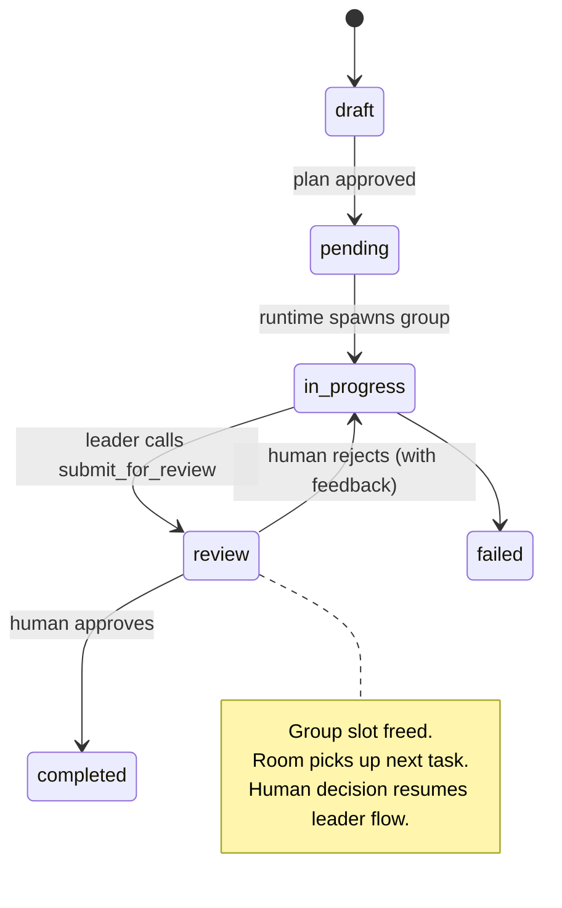
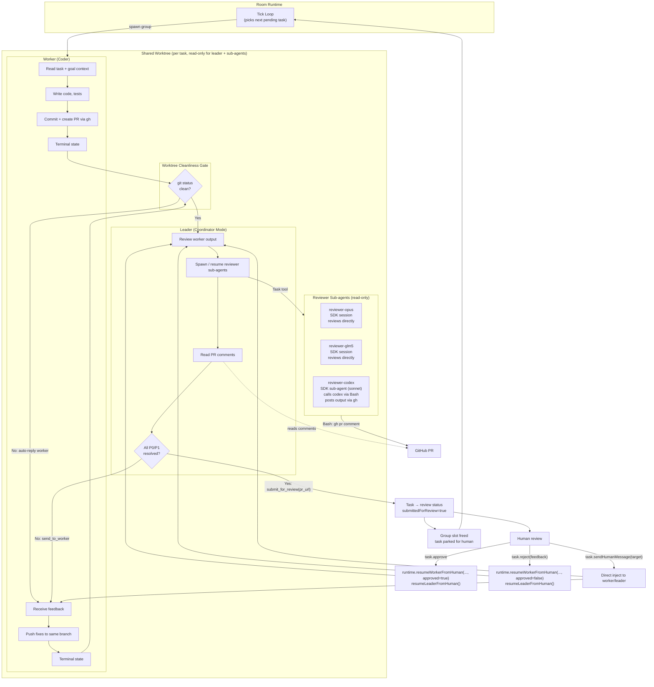
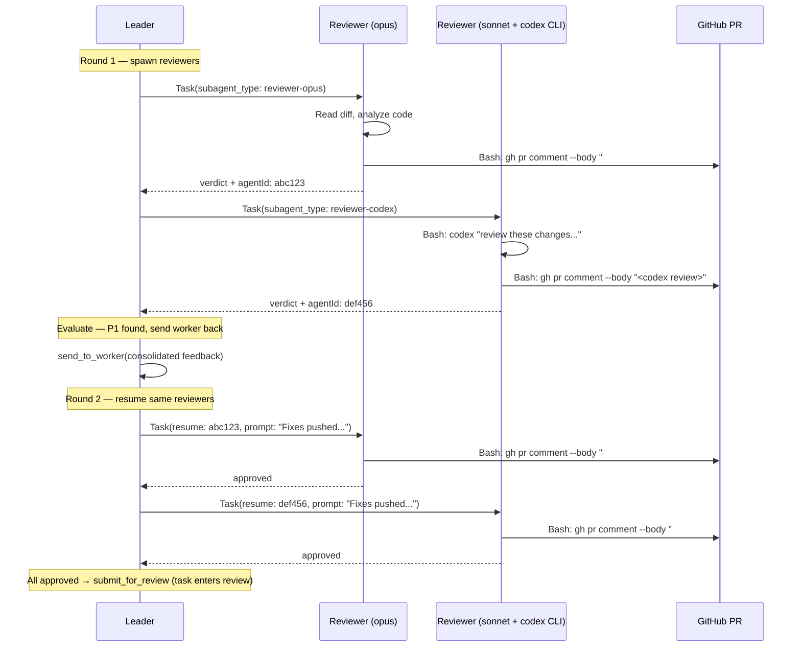

# PR Review Workflow - Design

## Overview

Automate the GitHub PR + multi-round AI peer review workflow within room autonomous execution.
The coding agent creates a PR, the leader (as coordinator) spawns reviewer sub-agents from
different models/providers, iterates until all blocking findings are resolved, then parks the
task for human approval while the room moves on to the next task.

## Task Lifecycle



## Current Session Group State

`session_groups.state` is compatibility metadata and currently uses:

- `awaiting_worker`
- `awaiting_leader`
- `awaiting_human`
- `completed`
- `failed`

`hibernated` is removed from the active model.

## Worker → Leader → Human Flow



## Reviewer Sub-agent Detail

The leader uses the coordinator's Task tool to spawn reviewer sub-agents. On subsequent
rounds, the leader is instructed to use `Task(resume: agentId)` to continue each reviewer's
session with full prior context preserved. This is the leader's choice — we just describe the
behavior in its system prompt.



---
## Current Implementation Notes

- Human approval and rejection use task-scoped RPCs:
  - `task.approve` resumes review tasks with `approved=true`
  - `task.reject` resumes review tasks with `approved=false`
- `task.sendHumanMessage` is available at any time and routes directly to worker or leader.
- Terminal status changes clean up runtime resources via runtime APIs:
  - `task.cancel` and `task.setStatus(..., cancelled)` use runtime cancellation
  - `task.setStatus(..., completed|failed)` uses runtime group termination

## Configuration (No New Tables)

Room agent configuration lives in the existing `Room.config` JSON field:

```json
{
  "reviewers": [
    { "model": "claude-opus-4-6", "provider": "anthropic" },
    { "model": "glm-5", "provider": "glm" },
    { "model": "codex", "type": "cli" }
  ],
  "maxReviewRounds": 5
}
```

The **Agents tab** reads available providers/models from the existing provider registry
and writes selections to `Room.config`. No new database tables.

## What We're NOT Building

- No new database tables
- No new runtime orchestration phase — leader handles review loop as coordinator
- No programmatic resume wiring — leader decides when to resume sub-agents
- No GitHub webhook integration — `gh` CLI is sufficient
- No special "CLI wrapper" agent type — just a normal sub-agent that calls CLI via Bash
- No `escalated` task status — tasks either fail or go to review
