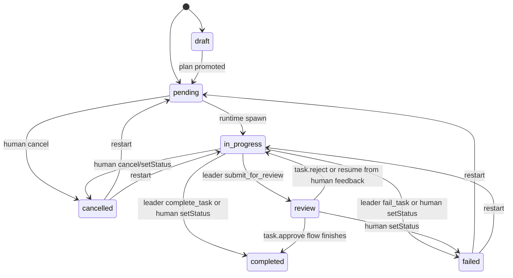
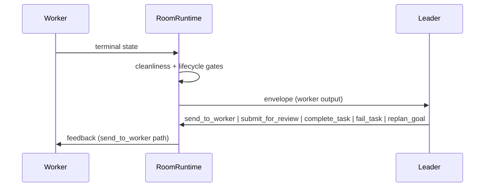
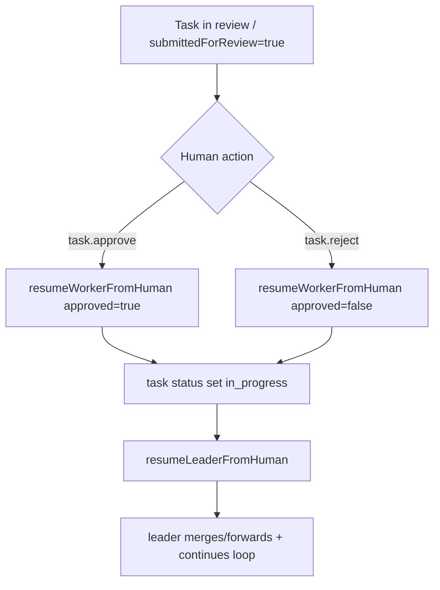
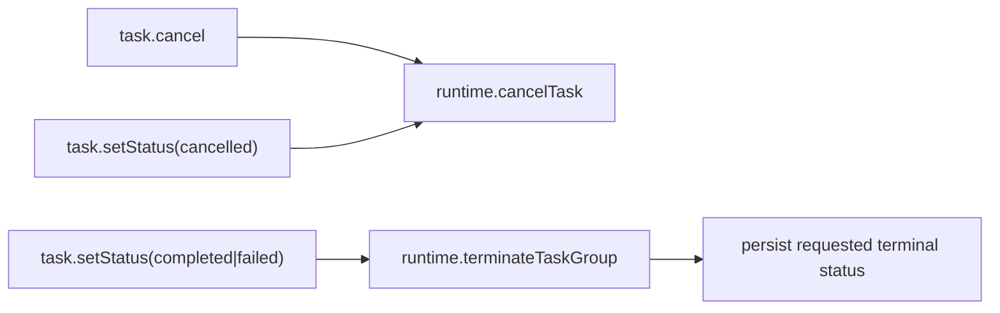

# Room Runtime Spec (Current Model)

Status: Active
Date: 2026-03-09

## Purpose

This document defines the current room-runtime orchestration model implemented in daemon code.
It is the source of truth for:

- task + session-group lifecycle
- worker/leader feedback loop
- human approval/rejection/messaging flow
- runtime cleanup and recovery semantics

Related docs:

- `docs/design/pr-review-workflow.md`
- `docs/design/task-status-control-design.md`

## Core Model

### Task Status Lifecycle

### Session Group Semantics

Session groups are stored in `session_groups`, but orchestration no longer depends on a strict runtime state machine.

- `completedAt !== null` means terminal group.
- `submittedForReview === true` means parked for human review (task is in `review`).
- `approved === true` means human approval has been recorded (used by planning/coder completion gates).
- DB `state` column is legacy and not authoritative for routing.

## Orchestration Loop

### Tick Scheduling

Runtime runs a periodic/scheduled tick with a mutex:

1. Recover zombie groups (missing in-memory sessions).
2. Compute active capacity using groups where `completedAt === null` and `submittedForReview === false`.
3. Planning has priority over execution.
4. Spawn execution groups for ready pending tasks up to capacity.

### Planning Priority

A goal is selected for planning when active and either:

- no tasks exist, or
- no active tasks remain and execution tasks are terminal (`failed`/`cancelled`).

Planning attempts are bounded by `maxPlanningRetries` (room config). Exceeding attempts moves goal to `needs_human`.

## Worker <-> Leader Loop

### Worker Terminal Handling

On worker terminal state:

1. enforce worktree cleanliness
2. run worker exit gate
3. build envelope + forward to leader
4. increment review iteration
5. update task progress (bounded review-progress model)

### Leader Tool Behavior

- `send_to_worker`
  - forwards feedback to worker
  - if `feedbackIteration >= maxReviewRounds`, runtime escalates to human review (`task.review`, `submittedForReview=true`)
- `handoff_to_worker`
  - compatibility no-op
- `submit_for_review(pr_url)`
  - sets `submittedForReview=true`
  - transitions task to `review`
  - keeps group alive but parked
- `complete_task(summary)`
  - allowed only after review submission or explicit human approval (`approved=true`) for planner/coder/general
  - runs leader complete gate
  - completes task + group cleanup
- `fail_task(reason)`
  - fails task + group cleanup
- `replan_goal(reason)`
  - fails current task, cancels pending siblings, spawns a replan planning task/group

## Human Collaboration APIs

| API | Intent | Current Behavior |
|---|---|---|
| `task.approve` | Approve task in `review` | Validates task/runtime, calls `resumeWorkerFromHuman(..., { approved: true })` |
| `task.reject` | Reject task in `review` with feedback | Calls `resumeWorkerFromHuman(..., { approved: false })` |
| `task.sendHumanMessage` | Direct human message | Routes directly to `worker` (default) or `leader`; no group-state gate |

### Review Resume Flow

Important detail:

- approvals and rejections are both routed to leader on resume.
- resume path rolls back task status/approval flag if resume fails.

## Manual Status Control and Cleanup

Runtime-backed terminal transitions are mandatory when runtime exists.

Behavior:

- `runtime.cancelTask(taskId)`
  - cascade-cancels task + pending dependents
  - terminates group sessions/mirroring
- `runtime.terminateTaskGroup(taskId)`
  - terminates group sessions/mirroring
  - does not force task status to `cancelled`

## Recovery Model

On startup and during ticks:

- runtime restores missing worker/leader sessions where possible
- reattaches observers
- fails groups whose worker session cannot be restored
- skips continuation injection for parked review groups (`submittedForReview=true`)

Recovery is proactive and idempotent; runtime remains reconstructable from DB + session store.

## Concurrency Rules

Capacity uses `maxConcurrentGroups` with one critical exclusion:

- parked review groups (`submittedForReview=true`) do **not** consume active slots.

This allows the room to continue autonomous execution while waiting for human review.

## Legacy Compatibility Notes

- Existing DB columns/strings like `state='awaiting_worker'` are retained for compatibility but are not the primary orchestration signal.
- Tool names like `handoff_to_worker` remain for compatibility, even where behavior is now a no-op.
- Historical design/plan docs may contain legacy state/status terms and are not authoritative for current behavior.

## Implementation Anchors

Primary implementation files:

- `packages/daemon/src/lib/room/runtime/room-runtime.ts`
- `packages/daemon/src/lib/room/runtime/task-group-manager.ts`
- `packages/daemon/src/lib/room/state/session-group-repository.ts`
- `packages/daemon/src/lib/rpc-handlers/task-handlers.ts`
- `packages/daemon/src/lib/rpc-handlers/goal-handlers.ts`
- `packages/daemon/src/lib/room/runtime/runtime-recovery.ts`
