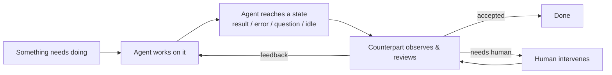
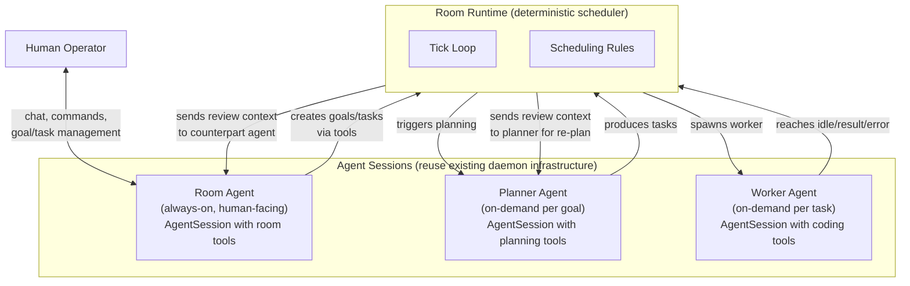
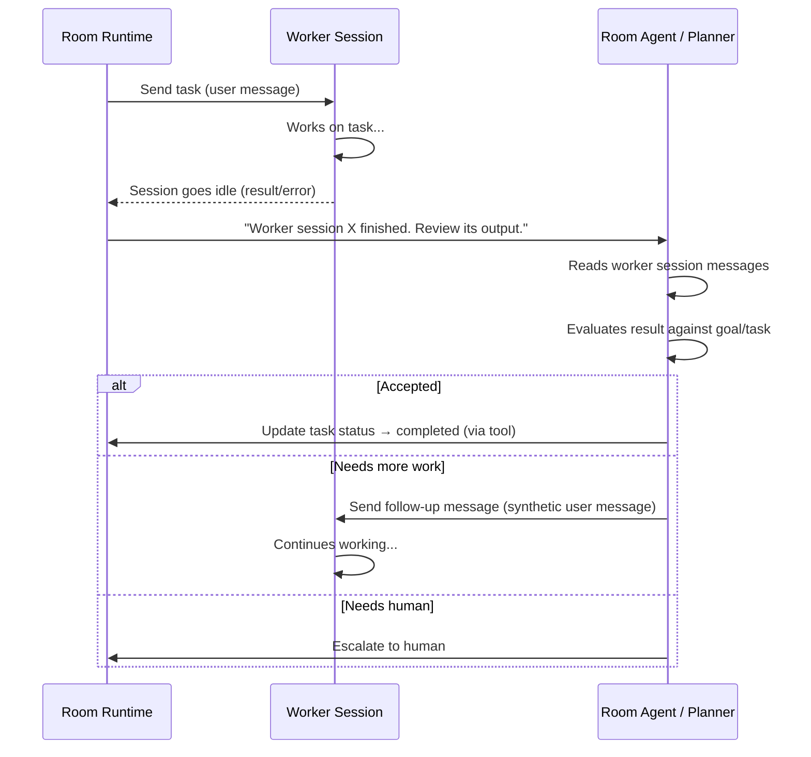
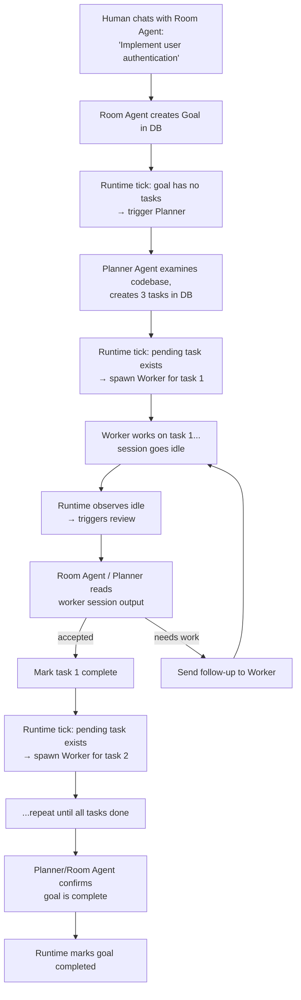

# Room Autonomy Design Spec — Fresh Start

Status: Draft v0.2
Date: 2026-02-23

## Context

NeoKai has a solid human-AI app with multi-session/worktree support. We've been trying to add room autonomy (agents working toward room goals autonomously while allowing human intervention) but the current implementation doesn't work. The architecture drifted from the original "neo" design to a complex "room self agent" design with too many moving parts.

**The core problem**: A room has goals. Work should happen on those goals continuously and autonomously. Humans should be able to intervene at any point.

## Why the Current Design Doesn't Work

The current `RoomSelfService` uses an **LLM as the orchestrator** — a persistent Claude session that receives injected messages and is expected to call tools (`room_create_task`, `room_spawn_worker`, etc.). This fails because:

1. **LLM orchestration is unreliable** — doesn't consistently call the right tools at the right time
2. **Too many states** — 7 lifecycle states with complex transition rules
3. **Double LLM cost** — orchestrator runs constantly alongside workers
4. **Event soup** — complex event subscription/unsubscription patterns
5. **Mixed responsibilities** — ~1300 lines handling everything

## The Fundamental Insight

> A room is like a small organization. You need someone thinking about goals and strategy (high-level), and someone doing the detailed work (execution). No one can hold everything in their head. These two levels need a mechanism to work together.

This maps to:
- **Goal Thinker** — looks at goals, creates concrete tasks, reviews outcomes, adjusts course
- **Task Worker** — takes a specific task, does the coding work, reports back

## The Core Abstraction: Do → Review Loop

Everything in this system follows the same meta-process:

This **do → review** loop is the universal pattern for:
- **Planning**: Planner proposes tasks → Reviewer/Human evaluates → iterate until plan is good
- **Coding**: Worker implements → Reviewer evaluates → iterate until task is done
- **Research**: Agent investigates → Reviewer checks findings → iterate until answer is clear

The loop is always between two parties: a **doer** and a **reviewer**. The reviewer can be an agent, a human, or both.

---

## Design: The Room Runtime

### Architecture Overview

### The Actors

#### 1. Room Runtime (deterministic code — no LLM)

The Room Runtime is the **scheduler**. It's a simple loop driven by triggers (timer, events). It makes no decisions about WHAT work to do — it decides WHEN to trigger agents and HOW to route information between them.

**Rules (hardcoded, not LLM-decided)**:
- A goal needs planning when: it's active AND has no pending/in-progress tasks
- A task is ready to execute when: status is `pending`
- A worker session needs attention when: it becomes idle / emits result / emits error
- The counterpart agent reviews worker output by reading worker session messages

**State**: `running` | `paused`. That's it.

#### 2. Room Agent (persistent AgentSession — human-facing)

The Room Agent is the **department head**. It's always available for human conversation. The human interacts with the room through this agent — asking questions, setting goals, managing tasks, providing guidance.

This is a full **AgentSession** (reusing existing daemon infrastructure), with:
- **Tools** for room management: create/update goals, create/update tasks, query room state
- **Access to room context**: goals, tasks, worker statuses, room instructions
- **Conversation persisted to DB** (like any other session)
- **Human can chat naturally** — "what's the status?", "prioritize the auth work", "add a goal for..."

The Room Agent is NOT the scheduler. It's the human interface. When the human creates a goal via conversation, the Room Agent calls its tools → data goes to DB → Room Runtime picks it up.

#### 3. Planner Agent (on-demand AgentSession — goal decomposition)

The Planner Agent breaks a goal into concrete tasks. Unlike a one-shot LLM call, it's a **full AgentSession** that can:
- Read the codebase (file trees, source files)
- Examine existing code to understand what needs to change
- Have a multi-turn internal conversation to refine the plan
- Use tools to inspect dependencies, test suites, etc.
- All conversations persisted to DB for auditability

**Trigger**: Room Runtime detects a goal needs planning → creates/resumes Planner session for that goal.

**Output**: Creates tasks in DB via tools (same pattern as Room Agent).

**Key**: Planning can be iterative. The Planner might produce an initial plan, then after some tasks execute and results come back, get triggered again to adjust the plan. Each planning session is stored and visible.

#### 4. Worker Agent (on-demand AgentSession — task execution)

The Worker executes a single task. It's a standard AgentSession with coding tools (bash, edit, read, etc.).

**No special worker tools needed.** The worker is a normal coding session. When it finishes or gets stuck:
- It reaches **idle state** (result message emitted)
- Or it emits an **error**
- Or it asks a **question** (via AskUserQuestion tool)

The Room Runtime **observes** these session state changes — exactly like a human would notice a session going idle. Then the Runtime triggers the counterpart (Room Agent or Planner) to review the worker's output by reading the worker session's messages.

**Human can interact with workers directly** — since workers are normal sessions, a human can open the worker session and chat with it, just like any other session. This is natural intervention.

### How Worker Review Works (No Special Tools)

The key insight: we don't need `worker_complete_task` or `worker_fail_task` tools. Instead:

The worker just does its job and goes idle. The counterpart agent reads its output and decides what happens next. This is exactly how a human manager reviews a developer's work.

### Data Flow: A Complete Cycle

### Human Intervention

Human intervention is NOT a special state. It works at two levels:

**Level 1: Traditional app controls**
| Human Action | How It Works |
|---|---|
| **Pause/Resume** | Runtime stops/starts processing triggers |
| **Add/edit/delete goals** | Direct DB operations via UI → Runtime picks up changes |
| **Add/edit/delete tasks** | Direct DB operations via UI → Runtime picks up changes |
| **Open worker session** | Interact with worker directly, like any normal session |

**Level 2: Conversational via Room Agent**
The Room Agent is always available. Human can:
- "What's the status of the auth feature?"
- "Prioritize the testing tasks"
- "Skip task 3, we don't need it"
- "Add a goal to refactor the database layer"
- "The worker seems stuck on the login endpoint, tell it to use JWT instead of sessions"

The Room Agent has tools to execute all of these. It's the CEO's interface to the department head.

### State Model

**Room Runtime**: `running` | `paused`

**Goals**: `active` | `completed` | `archived`

**Tasks**: `pending` | `in_progress` | `completed` | `failed`

**Sessions**: Worker sessions, Planner sessions, Room Agent session — all tracked via existing session infrastructure

No `planning`, `executing`, `reviewing`, `waiting`, `error` states for the room itself.

### When Does the Runtime Tick?

Event-driven with a timer fallback:

1. **Timer**: Every 30-60 seconds (catches anything missed)
2. **Goal created/updated**: Immediate tick
3. **Worker session goes idle**: Immediate tick
4. **Task status changed**: Immediate tick

Each tick runs the same deterministic logic. No special handling per trigger type.

### Error Handling

- **Planner session fails**: Log error, retry on next tick. No state change.
- **Worker session errors**: Counterpart agent reviews the error and decides next step.
- **Review agent fails**: Log error, retry on next tick. Worker output stays pending review.
- **Too many consecutive errors**: Runtime pauses itself, notifies human via Room Agent.

All errors are recoverable by re-running the tick. No stuck states.

### Capacity Management

- `maxConcurrentWorkers`: configurable per room (default: 1 for MVP)
- Runtime only spawns workers when below capacity
- Tasks execute sequentially (MVP)

### What We Reuse from Current Implementation

- **AgentSession infrastructure** — for ALL agents (Room Agent, Planner, Workers)
- **Session persistence** — all conversations stored in DB automatically
- **WorkerManager** — for spawning/tracking worker sessions (may need simplification)
- **Database schema** — rooms, goals, tasks tables
- **DaemonHub events** — for session state change observations
- **MessageHub** — for UI communication
- **Room UI** — dashboard, goal list, task list

### What We Replace

- **RoomSelfService** → new `RoomRuntime` (deterministic scheduler)
- **Room agent tools MCP** → new Room Agent tools (goal/task CRUD, room state queries)
- **Room agent prompts** → new prompts for Room Agent / Planner / Worker review
- **RoomSelfLifecycleManager** → not needed (only 2 states)
- **Worker tools (worker_complete_task etc.)** → not needed (session observation instead)

### New Components

1. **RoomRuntime** — deterministic scheduler loop
2. **Room Agent session setup** — AgentSession with room management tools
3. **Planner Agent session setup** — AgentSession with codebase access + task creation tools
4. **Session observation** — detecting when worker/planner sessions go idle/error

### Design Decisions (Resolved)

1. **Task execution**: Sequential only. One task at a time per goal. One worker at a time (MVP).
2. **Review policy**: Every worker idle/result is reviewed by a counterpart agent.
3. **Re-planning**: Planner is triggered when a goal has no pending/in-progress tasks.
4. **Agent infrastructure**: All agents (Room Agent, Planner, Worker) are AgentSessions. All conversations persisted to DB.
5. **No special worker tools**: Workers are normal sessions. Runtime observes session state. Counterpart sends follow-up messages.
6. **Human interface**: Room Agent is always-on, chat-based. Plus traditional UI for direct goal/task management.

### Open Questions (For Future Iterations)

1. **Parallel workers**: Multiple workers for different goals. Not MVP.
2. **Multi-agent review**: Having multiple agents with different models review specs/designs before committing (like the zig agent lib example). Not MVP but the do→review loop supports it naturally.
3. **Worker handoff**: Should a subsequent worker get context from previous workers' sessions?

---

## Implementation Plan

### Phase 1: Foundation
- RoomRuntime scheduler, session observation, Room Agent tools

### Phase 2: Planner
- Planner Agent setup, goal→task decomposition

### Phase 3: Worker Review Loop
- Counterpart agent reviews worker output, sends follow-ups

### Phase 4: Wire Up
- Replace RoomSelfService, wire RPCs, human intervention flows

### Phase 5: UI
- Update room dashboard, conversational Room Agent interface

### Verification (end-to-end acceptance criteria)
- Create a room, chat with Room Agent: "Add a health check endpoint to the API"
- Room Agent creates goal → Runtime triggers Planner → tasks created
- Runtime spawns Worker → Worker completes → counterpart reviews → accepts
- Repeat for remaining tasks → goal marked complete
- Human can: pause, chat with Room Agent, open worker sessions, edit tasks
- Add another goal and verify continuous operation
- Restart daemon mid-execution and verify recovery (no stuck states)
