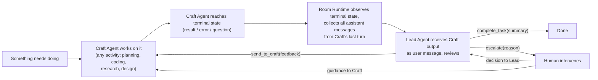
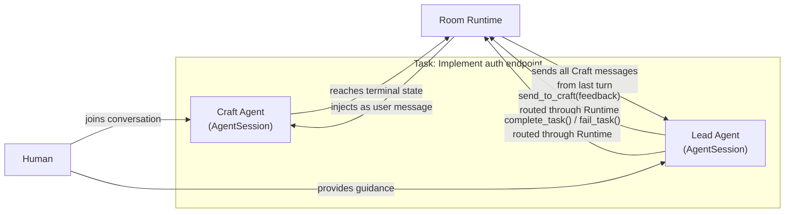
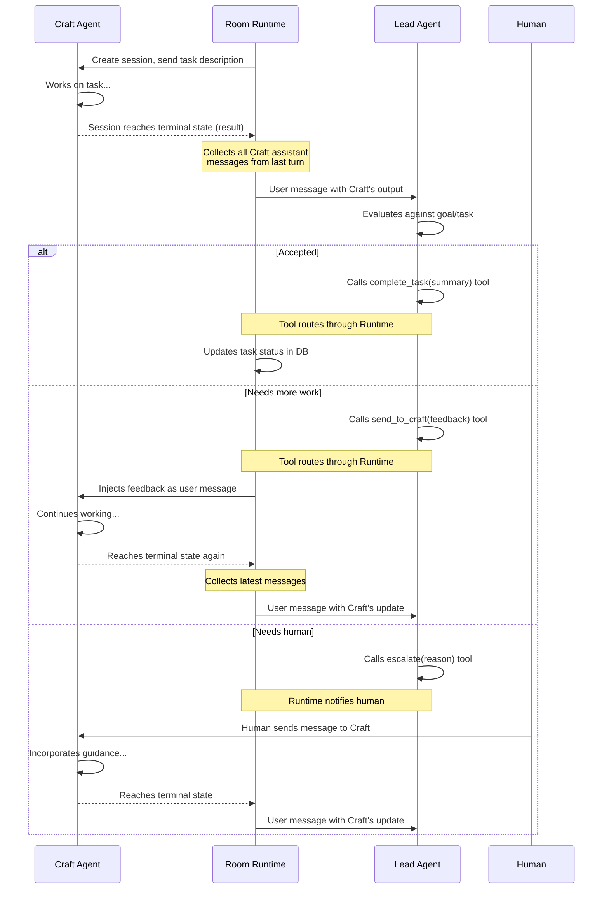
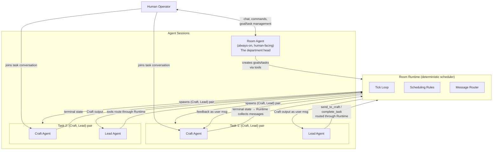
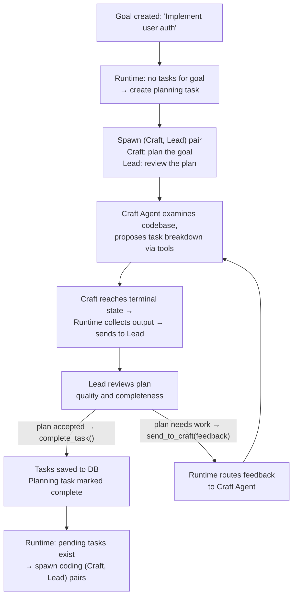
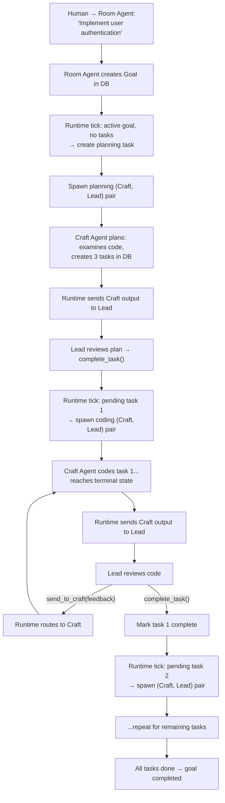
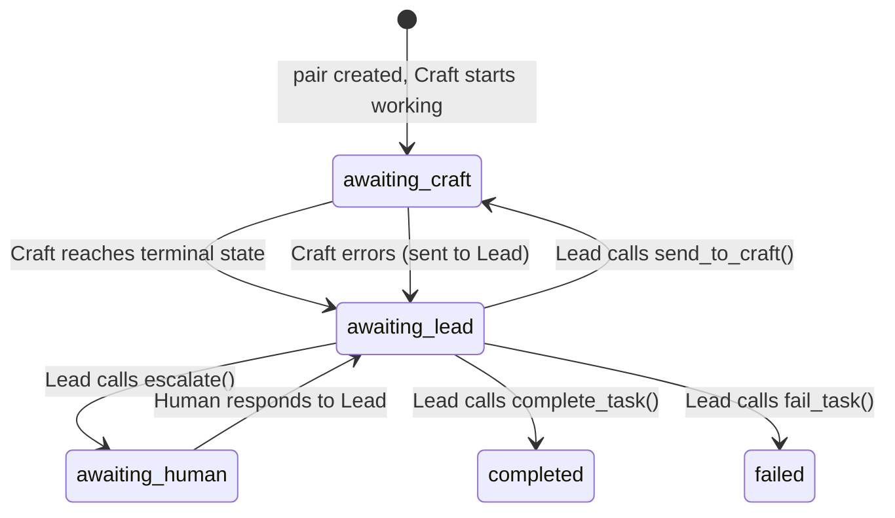
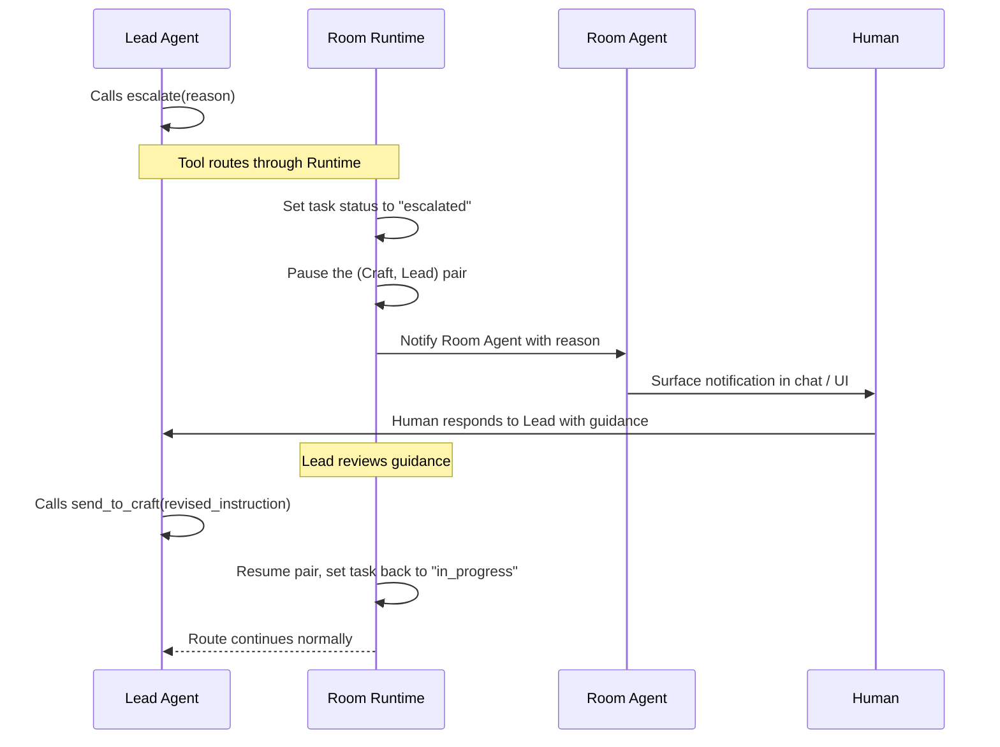

# Room Autonomy Design Spec — Fresh Start

Status: Draft v0.7
Date: 2026-02-23

## Context

NeoKai has a solid human-AI app with multi-session/worktree support. We've been trying to add room autonomy (agents working toward room goals autonomously while allowing human intervention) but the current implementation doesn't work. The architecture drifted from the original "neo" design to a complex "room self agent" design with too many moving parts.

**The core problem**: A room has goals. Work should happen on those goals continuously and autonomously. Humans should be able to intervene at any point.

## Why the Current Design Doesn't Work

The current `RoomSelfService` uses an **LLM as the orchestrator** — a persistent Claude session that receives injected messages and is expected to call tools (`room_create_task`, `room_spawn_worker`, etc.). This fails because:

1. **LLM orchestration is unreliable** — doesn't consistently call the right tools at the right time
2. **Too many states** — 7 lifecycle states with complex transition rules
3. **Double LLM cost** — orchestrator runs constantly alongside workers
4. **Event soup** — complex event subscription/unsubscription patterns
5. **Mixed responsibilities** — ~1300 lines handling everything

## The Fundamental Insight

> A room is like a small organization. You need someone thinking about goals and strategy (high-level), and someone doing the detailed work (execution). No one can hold everything in their head. These two levels need a mechanism to work together.

---

## The Core Abstraction: Craft → Lead Loop

Everything in this system follows the same meta-process. **Planning, coding, researching, designing** — they're all just activities. The abstraction is always the same: one agent crafts, one agent leads and gives feedback.



The **Craft → Lead loop** is universal:

| Activity | Craft Agent does | Lead Agent does |
|---|---|---|
| **Planning** | Examines codebase, proposes task breakdown | Reviews plan quality, suggests adjustments |
| **Coding** | Implements feature, writes tests | Reviews code, checks correctness, requests fixes |
| **Research** | Investigates options, gathers findings | Evaluates findings, asks deeper questions |
| **Design** | Drafts architecture, creates specs | Reviews design, identifies gaps, validates approach |
| **PR Review** | Addresses review comments, pushes fixes | Reads diff, leaves feedback, approves/requests changes |

The loop is always between two parties: a **Craft Agent** and a **Lead Agent**. The Lead can be an agent, a human, or both, or a process involving many parties (like a PR review).

### The (Craft, Lead) Pair

Every task in the system creates a **(Craft, Lead) pair** — two agent sessions that collaborate:



- **Craft Agent**: Full AgentSession with activity-appropriate tools. It does the work and naturally reaches a terminal state when done. Planning Craft Agents additionally get `create_task` tools for writing tasks to DB — this is an activity-specific tool, not a completion signal.
- **Lead Agent**: Full AgentSession that reviews Craft Agent's output. Created once per task and **reused across all feedback iterations** (maintains full review context). Room Runtime sends all Craft Agent assistant messages from its last turn as a user message to Lead. Lead evaluates and uses tools to respond.
- **Room Runtime**: All message routing between Craft and Lead goes through Runtime. Runtime observes session terminal states, collects messages, and routes them. Human messages to Craft are **queued** while Lead is actively reviewing (MVP).
- **Human**: Can participate at any time — send messages to Craft Agent directly, or provide guidance to Lead Agent.

### Message Routing Through Room Runtime

All inter-agent communication is routed through the Room Runtime:



**Why all routing goes through Runtime**:
1. Runtime tracks state — knows when to re-observe Craft's next terminal state
2. All inter-agent messages flow through one place — auditable
3. Runtime can enforce guard rails (e.g., max feedback iterations)
4. Consistent routing pattern in both directions

### Lead Agent Tools

Lead Agent has a focused tool set, all routed through Room Runtime:

| Tool | Purpose | Runtime action |
|---|---|---|
| `send_to_craft(message)` | Send feedback/follow-up to Craft Agent | Injects as user message into Craft session |
| `complete_task(summary)` | Accept the work, mark task done | Updates task status in DB |
| `fail_task(reason)` | Task is not achievable | Updates task status, notifies Room Agent |
| `escalate(reason)` | Flag for human attention | Notifies human via Room Agent / UI |
| `read_craft_messages(limit)` | Pull more Craft messages beyond what Runtime sent | Returns messages from Craft session |

### Task Chat View: Sub-Agent Blocks

The (Craft, Lead) pair is rendered in the UI as a **single conversation** using **sub-agent blocks**. Each agent's complete turn (thinking + tool uses + result) is grouped into one collapsible block:

```
┌─────────────────────────────────────────────────┐
│ Task: Implement auth endpoint                    │
├─────────────────────────────────────────────────┤
│                                                  │
│ ┌─ 🔨 Craft Agent ────────────────────────────┐ │
│ │ I'll start by examining the existing route   │ │
│ │ structure...                                 │ │
│ │ ▸ Read src/routes/index.ts                   │ │
│ │ ▸ Read src/routes/auth.ts                    │ │
│ │ ▸ Edit src/routes/auth.ts (+42 lines)        │ │
│ │ ▸ Edit src/middleware/validate.ts (+18 lines) │ │
│ │                                              │ │
│ │ Created the POST /api/auth/login endpoint    │ │
│ │ with JWT token generation.                   │ │
│ └──────────────────────────────────────────────┘ │
│                                                  │
│ ┌─ 👁 Lead Agent ─────────────────────────────┐ │
│ │ The endpoint looks good but you missed       │ │
│ │ input validation. Add zod schema validation  │ │
│ │ for the request body.                        │ │
│ │ ▸ send_to_craft("Add zod schema...")         │ │
│ └──────────────────────────────────────────────┘ │
│                                                  │
│ ┌─ 🔨 Craft Agent ────────────────────────────┐ │
│ │ Good catch. Adding zod validation now...     │ │
│ │ ▸ Edit src/routes/auth.ts (+12 lines)        │ │
│ │                                              │ │
│ │ Added zod schema for login request body.     │ │
│ └──────────────────────────────────────────────┘ │
│                                                  │
│ 👤 Human: Also make sure to rate-limit the      │
│    login endpoint                                │
│                                                  │
│ ┌─ 🔨 Craft Agent ────────────────────────────┐ │
│ │ Adding rate limiting...                      │ │
│ │ ▸ Edit src/middleware/rate.ts (+25 lines)     │ │
│ │ ▸ Edit src/routes/auth.ts (+3 lines)         │ │
│ │                                              │ │
│ │ Added rate limiting middleware to the login   │ │
│ │ endpoint (max 5 attempts per minute).        │ │
│ └──────────────────────────────────────────────┘ │
│                                                  │
│ ┌─ 👁 Lead Agent ─────────────────────────────┐ │
│ │ Looks complete. All requirements met.        │ │
│ │ ▸ complete_task("Implemented auth endpoint   │ │
│ │   with JWT, validation, and rate limiting")  │ │
│ └──────────────────────────────────────────────┘ │
│                                                  │
│ ✅ Task completed                                │
└─────────────────────────────────────────────────┘
```

**Rendering rules**:
- **Craft Agent turns** → sub-agent block with 🔨 icon, assistant color scheme. Each complete turn (all thinking + tool uses + result) is one collapsible block.
- **Lead Agent turns** → sub-agent block with 👁 icon, distinct color scheme. Each complete turn is one block.
- **Human messages** → standard user message style (not in a sub-agent block)
- **Turns are interleaved chronologically** from both sessions

**Behind the scenes**:
- Craft Agent session: receives Lead feedback and Human messages as user messages
- Lead Agent session: receives Craft output (all assistant messages from last turn) as user messages from Runtime
- Human messages to Craft are real user messages in the Craft session
- Lead's `send_to_craft()` tool calls route through Runtime → injected as user messages in Craft session

---

## Design: The Room Runtime

### Architecture Overview



### The Actors

#### 1. Room Runtime (deterministic code — no LLM)

The Room Runtime is the **scheduler and router**. It's a simple loop driven by triggers (timer, events). It makes no decisions about WHAT work to do — it decides WHEN to create (Craft, Lead) pairs, routes messages between them, and executes Lead Agent tool calls.

**Scheduling rules (hardcoded, not LLM-decided)**:
- A goal needs planning when: it's active AND has no pending/in-progress tasks AND `planning_attempts < max_planning_attempts` (default: 3)
- A task is ready to execute when: status is `pending`
- Planning is itself a task: "Plan goal X" → creates a (Craft, Lead) pair where Craft Agent plans
- If all tasks for a goal have `failed` and `planning_attempts >= max_planning_attempts`, the goal enters `needs_human` status — Runtime stops auto-planning and notifies human via Room Agent

**Routing rules**:
- When Craft Agent reaches terminal state → collect all assistant messages from its last turn → send to Lead Agent as user message
- When Craft Agent emits `AskUserQuestion` → route question to Lead Agent first. Lead can answer via `send_to_craft()` or `escalate()` to human
- When Lead Agent calls `send_to_craft()` → inject message into Craft Agent session as user message
- When Lead Agent calls `complete_task()` / `fail_task()` → update task in DB → trigger next tick
- When human sends message to Craft during Lead review → queue message until Lead's current review cycle completes
- **Urgent control actions** (`cancel_task`, `pause runtime`) bypass the message queue and execute immediately via Room Agent tools, even if Lead is mid-review

**State**: `running` | `paused`. That's it.

**Tick respects capacity**: Each tick checks `maxConcurrentPairs`. If at capacity, pending tasks wait — no wasted ticks.

#### 2. Room Agent (persistent AgentSession — human-facing)

The Room Agent is the **department head**. It's always available for human conversation.

This is a full **AgentSession** with:
- **Tools** for room management (see table below)
- **Access to room context**: goals, tasks, active (Craft, Lead) pairs, room instructions
- **Conversation persisted to DB** (like any other session)
- **Human can chat naturally** — "what's the status?", "prioritize the auth work", "add a goal for..."

**Room Agent Tools**:

| Tool | Purpose |
|---|---|
| `create_goal(title, description)` | Create a new goal for the room |
| `update_goal(goalId, updates)` | Update goal title/description/status |
| `list_goals()` | List all goals with their status |
| `create_task(goalId, title, description)` | Manually create a task for a goal |
| `update_task(taskId, updates)` | Update task details or priority |
| `cancel_task(taskId)` | Kill the active (Craft, Lead) pair, mark task failed |
| `retry_task(taskId)` | Kill current pair, create new (Craft, Lead) pair |
| `get_task_status(taskId)` | Get task state including recent Craft/Lead messages |
| `list_tasks(goalId?)` | List tasks, optionally filtered by goal |
| `get_room_status()` | Overview: runtime state, active pairs, goal/task summary |

The Room Agent is NOT the scheduler. It's the human interface. When the human creates a goal via conversation, the Room Agent calls its tools → data goes to DB → Room Runtime picks it up.

**Coordination with Runtime**: Room Agent tools that modify task state (`cancel_task`, `retry_task`, `update_task`) use **optimistic locking** — they check `task.version` before writing, and fail gracefully if Runtime has already transitioned the task. This prevents races where Room Agent cancels a task that Runtime just completed. On conflict, the tool returns the current state so Room Agent can inform the human.

#### 3. Craft Agent (on-demand AgentSession — per task)

The Craft Agent works on a task. It's a standard AgentSession with tools appropriate for the activity:
- **Coding task**: bash, edit, read, write, glob, grep (standard coding tools)
- **Planning task**: read, glob, grep (codebase exploration) + `create_task(goalId, title, description)` for writing tasks to DB
- **Research task**: read, web search, etc.
- **Design task**: read, write (spec writing)

The Craft Agent has **no special completion-signaling tools**. It doesn't tell the system it's done — the system observes it. Activity-specific tools (like `create_task` for planning) are allowed. When the Craft Agent finishes, the SDK emits a terminal state:
- **Result** (`type: "result"`, `subtype: "success"`) — normal turn completion → Runtime collects output, sends to Lead
- **Error** (`type: "result"`, `subtype: "error"`) — turn failed → Runtime sends error context to Lead
- **AskUserQuestion** (tool use detected via `canUseTool` callback) — session enters `waiting_for_input` → Runtime routes question to Lead first

**Safety net**: A cron job (every 60s) checks all in-progress sessions to catch missed terminal states. Scenarios it guards against:
- SDK event listener detached after hot module reload during development
- Event callback threw an unhandled exception, preventing state transition
- Race condition where session reached terminal state between observer setup and first check
- Process recovered from an uncaught exception that disrupted the event loop

Human can open this session and interact with it directly.

#### 4. Lead Agent (on-demand AgentSession — per task)

The Lead Agent reviews Craft Agent's work. It's a full AgentSession with tools routed through Room Runtime.

**Lifecycle**: Created **once per task** and reused across all feedback iterations. This gives Lead full accumulated context of the entire review history. The Lead session lives for the duration of the task.

**Tools** (all routed through Room Runtime):

| Tool | Purpose |
|---|---|
| `send_to_craft(message)` | Send feedback/follow-up to Craft Agent |
| `complete_task(summary)` | Accept the work, mark task done |
| `fail_task(reason)` | Task is not achievable |
| `escalate(reason)` | Flag for human attention (see Escalation Flow) |
| `read_craft_messages(limit)` | Pull more Craft messages if needed |

**System prompt includes**:
- The goal description this task belongs to
- The specific task description and acceptance criteria
- Room-level instructions/guidelines (coding standards, review policy, etc.)
- Review policy: what to check for (correctness, completeness, style, tests)
- Available tools and when to use each

**Context management**: Each message from Runtime to Lead includes a structured header:
- **Immutable context** (in system prompt): goal, task description, room instructions
- **Rolling context** (accumulated in session): all previous review exchanges
- **Latest delta** (in user message): Craft's output from this iteration

Lead session may need **context compaction** on long-running tasks. When Lead's conversation exceeds ~80% of the context window, Runtime summarizes older review exchanges before injecting the next Craft output. This uses the existing AgentSession compaction mechanism.

The Lead Agent is triggered when Room Runtime sends it a user message containing Craft Agent's output. It evaluates the output against the goal/task context and uses its tools to respond.

**Lead tool contract**: Lead Agent must call **exactly one terminal tool** per turn: `complete_task`, `fail_task`, `escalate`, or `send_to_craft`. If Lead emits text with no tool call, or calls multiple conflicting tools, Runtime treats it as an error: it retries once with a system nudge ("You must call exactly one of: send_to_craft, complete_task, fail_task, or escalate"). If the second attempt also fails, Runtime escalates to human.

**Lead Agent question handling**: If Lead Agent itself triggers `AskUserQuestion`, Runtime routes it directly to the human (unlike Craft questions which route to Lead first). This is because Lead is already the review layer — there's no higher agent to route to.

**Turn boundary tracking**: Task pairs track `last_forwarded_message_id` — the ID of the last Craft message forwarded to Lead. When Craft reaches a terminal state, Runtime collects all assistant messages with ID > `last_forwarded_message_id`, forwards them, and updates the marker. This prevents duplicate or skipped reviews across restarts.

**Loop termination guards**:
- `max_feedback_iterations`: default 10 per task. After N `send_to_craft` cycles without `complete_task`/`fail_task`, Runtime auto-escalates to human
- `max_no_progress_iterations`: if Lead sends the same feedback 3 times consecutively (stagnation), auto-escalate
- `task_timeout`: wall-clock timeout per task (default: 30 minutes). On expiry, Runtime pauses pair and escalates
- All thresholds configurable per room

### Planning as a (Craft, Lead) Pair

Planning is not a special actor — it's just another activity for a (Craft, Lead) pair:



### Data Flow: A Complete Cycle



### Human Intervention

Human intervention is NOT a special state. It works at multiple levels:

**Level 1: Room Agent conversation (the department head)**
- "What's the status of the auth feature?"
- "Prioritize the testing tasks"
- "Skip task 3, we don't need it"
- "Add a goal to refactor the database layer"
- "The worker seems stuck, tell it to use JWT instead of sessions"

**Level 2: Direct task participation (join the group chat)**
- Open a task view → see Craft and Lead conversation in sub-agent blocks
- Send a message → goes to Craft Agent as user input
- Human becomes a third participant in the (Craft, Lead) loop

**Level 3: Traditional app controls**
| Action | Effect |
|---|---|
| Pause/Resume runtime | Stops/starts scheduling |
| Add/edit/delete goals | DB changes → Runtime picks up on next tick |
| Add/edit/delete tasks | DB changes → Runtime picks up on next tick |
| Reorder task priority | Affects which task Runtime picks next |

### State Model

**Room Runtime**: `running` | `paused`

**Goals**: `active` | `needs_human` | `completed` | `archived`

**Tasks**: `pending` | `in_progress` | `escalated` | `completed` | `failed`

**Task pair lifecycle** (explicit state machine for deterministic recovery):



| Pair state | Meaning | Who acts next |
|---|---|---|
| `awaiting_craft` | Craft Agent is working or about to receive feedback | Craft |
| `awaiting_lead` | Craft output collected, waiting for Lead review | Lead |
| `awaiting_human` | Escalated, pair paused until human responds | Human |
| `completed` | Lead accepted, task done | — |
| `failed` | Lead rejected or unrecoverable error | — |

No `planning`, `executing`, `reviewing`, `waiting`, `error` states for the room itself.

### When Does the Runtime Tick?

Event-driven with a timer fallback:

1. **Timer**: Every 30-60 seconds (catches anything missed)
2. **Goal created/updated**: Immediate tick
3. **Craft Agent session reaches terminal state**: Immediate tick
4. **Lead Agent tool call executed**: Immediate tick (after `complete_task`, `fail_task`)
5. **Task status changed**: Immediate tick

Each tick runs the same deterministic logic. No special handling per trigger type.

**Tick idempotency**: Runtime uses a single-flight mutex — only one tick executes at a time. If multiple events fire concurrently (timer + session terminal state), the first acquires the lock, subsequent triggers queue a single re-tick after the current one completes. This prevents double-spawning pairs, double-delivering feedback, or duplicate `complete_task` processing.

### Error Handling

- **Craft Agent session errors**: Runtime sends error context to Lead Agent as a structured user message:
  ```
  [CRAFT ERROR] Task: {task_title}
  Error type: {sdk_error_subtype}
  Last tool call: {tool_name}({args_summary})
  Error message: {error_message}
  Craft's last assistant message before error: {last_message_excerpt}
  ```
  Lead decides: `send_to_craft` (retry with guidance), `fail_task`, or `escalate`.
- **Lead Agent session fails**: Log error, retry on next tick. Craft output stays pending review.
- **Too many consecutive errors**: Runtime pauses itself, notifies human via Room Agent.

All errors are recoverable by re-running the tick. No stuck states.

### Escalation Flow

When Lead Agent calls `escalate(reason)`:



**Task state during escalation**: `escalated` (a sub-state of `in_progress`). The pair is paused — Lead waits for human input, Craft is idle. Human responds **directly to Lead** (since Lead has the review context), and Lead translates guidance into actionable feedback for Craft.

**Queued messages on escalation**: When Lead calls `escalate()`, any human messages that were queued during Lead's review are **delivered to Lead** along with the escalation context. This way the human's earlier input isn't lost — Lead sees both the escalation reason and any human messages that arrived during review.

### Goal Completion

When all tasks for a goal are completed, Runtime triggers a **goal review** (Craft, Lead) pair:

1. Runtime detects: all tasks for goal X have status `completed`
2. Runtime creates a special task: "Review goal: X"
3. Spawns a (Craft, Lead) pair where Craft Agent receives via system prompt:
   - The original goal description
   - All completed task summaries (from `complete_task(summary)` calls)
   - The Craft Agent then verifies the goal is satisfied (may use `read`, `glob`, `grep` tools to inspect actual results)
   - Either confirms completion or creates additional tasks via `create_task` tool
4. Lead Agent reviews the assessment
5. If confirmed → Runtime marks goal as `completed`
6. If gaps found → new tasks created → Runtime picks them up on next tick

**Goal review cycle cap**: Maximum 2 goal review cycles per goal. If the second review still finds gaps, Runtime marks the goal as `needs_human` and notifies via Room Agent rather than creating endless review loops.

### Daemon Restart / Recovery

Runtime state is **reconstructed from DB on startup**. No in-memory-only state.

**Recovery procedure**:
1. On daemon start, Runtime queries DB for all `in_progress` tasks with active task pairs
2. For each task pair, check if the AgentSessions still exist:
   - **Session exists + idle**: Re-observe, resume the Craft→Lead flow
   - **Session exists + processing**: Attach observer, wait for terminal state
   - **Session exists + waiting_for_input**: Re-route the pending question
   - **Session gone** (process crashed): Mark task as `failed` with reason `session_lost`
3. Runtime resumes `running` state and continues normal tick loop

**Message queue recovery**: On restart, Runtime scans `task_messages` for entries with `status = 'pending'` and reprocesses them in `created_at` order. Since messages are scoped to `pair_id` + `to_session_id`, only messages for still-active pairs are delivered. Messages targeting sessions that no longer exist are marked `dead_letter`.

**Non-idempotent task recovery**: When a Craft session is lost after it has already made changes (edited files, ran commands), blind retry is dangerous — it could duplicate side effects. For lost sessions, Runtime marks the task `failed` and **does not auto-retry**. The human must acknowledge and decide: retry (if workspace state is safe) or manually intervene. Room Agent surfaces these failures prominently.

**Key invariant**: All state that matters (goals, tasks, task pairs, session IDs) lives in the DB. Runtime is stateless and reconstructable.

### Message Queue (Prerequisite)

The message routing between agents requires a **DB-backed queue system** to ensure reliability:

- Messages between Craft and Lead must survive daemon restarts
- Human messages sent during Lead review must be queued and delivered in order
- Messages are scoped to a specific `pair_id` + `to_session_id` to prevent misdelivery on task retry
- Urgent control actions (cancel, pause) bypass the queue entirely

This is a **prerequisite component** that should be designed and implemented before the Craft→Lead loop.

### Capacity Management

- `maxConcurrentPairs`: configurable per room (default: 1 for MVP)
- Runtime only spawns (Craft, Lead) pairs when below capacity
- Each tick checks capacity before spawning — pending tasks wait without wasted ticks
- Tasks execute sequentially (MVP)

### Database Schema

```sql
-- Task pairs: tracks the (Craft, Lead) sessions for each task
CREATE TABLE task_pairs (
    id TEXT PRIMARY KEY,
    task_id TEXT NOT NULL REFERENCES tasks(id),
    craft_session_id TEXT NOT NULL,
    lead_session_id TEXT NOT NULL,
    pair_state TEXT NOT NULL DEFAULT 'awaiting_craft',
        -- awaiting_craft | awaiting_lead | awaiting_human | completed | failed
    last_forwarded_message_id TEXT,  -- turn boundary marker
    feedback_iteration INTEGER NOT NULL DEFAULT 0,
    version INTEGER NOT NULL DEFAULT 0,  -- optimistic locking
    created_at INTEGER NOT NULL,
    completed_at INTEGER
);

-- Message queue: reliable inter-agent message delivery
CREATE TABLE task_messages (
    id TEXT PRIMARY KEY,
    task_id TEXT NOT NULL REFERENCES tasks(id),
    pair_id TEXT NOT NULL REFERENCES task_pairs(id),
    from_role TEXT NOT NULL,       -- 'craft' | 'lead' | 'human'
    to_role TEXT NOT NULL,         -- 'craft' | 'lead'
    to_session_id TEXT NOT NULL,   -- target session (prevents misdelivery on retry)
    payload TEXT NOT NULL,         -- JSON message content
    status TEXT NOT NULL DEFAULT 'pending',  -- pending | delivered | dead_letter
    created_at INTEGER NOT NULL,
    delivered_at INTEGER
);
```

---

## What We Reuse

- **AgentSession infrastructure** — for ALL agents (Room Agent, Craft, Lead)
- **Session persistence** — all conversations stored in DB automatically
- **Sub-agent block UI components** — already exist, used for Task Chat View
- **Database schema** — rooms, goals, tasks tables
- **DaemonHub events** — for session state change observations
- **MessageHub** — for UI communication

## What We Replace

- **RoomSelfService** → new `RoomRuntime` (deterministic scheduler + router)
- **Room agent tools MCP** → new Room Agent tools (goal/task CRUD, room state queries)
- **RoomSelfLifecycleManager** → not needed (only 2 states)
- **Worker tools (worker_complete_task etc.)** → Lead Agent tools instead
- **WorkerManager** → replaced by (Craft, Lead) pair manager

## New Components

1. **RoomRuntime** — deterministic scheduler loop + message router
2. **Room Agent tools** — MCP tools for goal/task CRUD, room state queries, task cancel/retry
3. **Lead Agent tools** — MCP tools: `send_to_craft`, `complete_task`, `fail_task`, `escalate`, `read_craft_messages`
4. **Task pair manager** — creates and tracks (Craft, Lead) pairs for tasks
5. **Session observer** — detects terminal states (Result/Error/AskQuestion) + cron safety net
6. **DB-backed message queue** — reliable inter-agent message delivery with human message queueing
7. **Task Chat View UI** — unified chat rendering with sub-agent blocks for (Craft, Lead, Human)

## Design Decisions (Resolved)

1. **Task execution**: Sequential only. One (Craft, Lead) pair at a time (MVP).
2. **Review policy**: Every Craft Agent terminal state triggers Lead Agent review via Runtime.
3. **Planning is a task**: Not a special actor. Planning creates a (Craft, Lead) pair like any other task.
4. **All agents are AgentSessions**: Room Agent, Craft, Lead all reuse existing session infrastructure. All conversations persisted.
5. **Craft Agents have no completion-signaling tools**: They just work and reach terminal state. Activity-specific tools (e.g., `create_task` for planning) are allowed.
6. **Lead Agent tools route through Runtime**: `send_to_craft`, `complete_task`, etc. all go through Runtime for consistent routing, tracking, and guard rails.
7. **Runtime collects all messages from Craft's last turn**: When Craft reaches terminal state, Runtime collects all assistant messages since the last user message and sends to Lead.
8. **Lead session created once, reused**: Lead Agent is created when the task starts and reused across all feedback iterations, maintaining full review context.
9. **Human interface**: Room Agent is always-on department head. Humans can also join any task's group chat.
10. **Task Chat View**: (Craft, Lead) pair rendered as unified conversation with sub-agent blocks per turn.
11. **Naming**: Craft Agent (does the work) + Lead Agent (reviews and directs).
12. **AskUserQuestion routes to Lead first**: When Craft asks a question, Runtime sends it to Lead. Lead can answer or escalate to human.
13. **Human messages queued during Lead review**: Prevents race conditions. Messages delivered after Lead's current review cycle.
14. **Goal completion triggers review**: When all tasks done, Runtime spawns a goal-review (Craft, Lead) pair to verify the goal is truly met.
15. **Recovery from DB**: Runtime is stateless and reconstructable. All state lives in DB. On restart, Runtime queries in-progress tasks and re-attaches.
16. **DB-backed message queue**: Prerequisite for reliable inter-agent message delivery.
17. **Session idle detection**: SDK terminal states (Result/Error/AskQuestion) + cron job safety net every 60s.
18. **Model selection**: Use room default model for both Craft and Lead (configurable later).
19. **Tick idempotency**: Single-flight mutex prevents concurrent ticks from double-spawning or double-delivering.
20. **Explicit pair state machine**: Pairs have 5 states (`awaiting_craft`, `awaiting_lead`, `awaiting_human`, `completed`, `failed`) for deterministic recovery.
21. **Lead tool contract**: Exactly one terminal tool per turn. Invalid responses get one retry with system nudge, then escalate.
22. **Turn boundary tracking**: `last_forwarded_message_id` on task pairs prevents duplicate/skipped reviews.
23. **Loop termination**: `max_feedback_iterations` (10), stagnation detection (3), wall-clock timeout (30min). All configurable.
24. **Non-idempotent recovery**: Lost sessions mark task `failed` without auto-retry. Human must acknowledge.
25. **Optimistic locking**: Room Agent tools check `task.version` to prevent races with Runtime state transitions.
26. **Goal review cap**: Max 2 goal review cycles, then `needs_human`.
27. **Planning attempt cap**: Max 3 planning attempts per goal before `needs_human`.
28. **Urgent controls bypass queue**: `cancel_task`, `pause runtime` execute immediately, not queued.
29. **Lead questions route to human**: Lead Agent's `AskUserQuestion` goes directly to human (no higher review layer).

## Open Questions (For Future Iterations)

1. **Parallel (Craft, Lead) pairs**: Multiple pairs for different tasks/goals. Requires: per-room scheduler lock, worktree isolation policy, fair task selection, and starvation prevention. Not MVP.
2. **Task dependency management**: Priority/dependency constraints across goals/tasks need first-class representation for parallel mode. Sequential MVP sidesteps this but it must be solved before `maxConcurrentPairs > 1`.
3. **Multi-reviewer**: Multiple Lead Agents with different models reviewing the same work (consensus-based review). The Craft→Lead loop supports this naturally.
4. **Room Agent as Lead**: Should the Room Agent serve as Lead for tasks, or should each task get its own dedicated Lead? Trade-off: shared context vs. isolation.
5. **Cross-task context**: Should a subsequent Craft Agent get context from previous tasks' sessions?
6. **External review integration**: PR reviews, CI results as input to Lead Agent.

---

## Implementation Plan

### Phase 0: Prerequisites
- DB-backed message queue system (task_messages table + queue logic)
- Database schema additions (task_pairs, task_messages tables)

### Phase 1: Foundation
- RoomRuntime scheduler loop (tick loop, event-driven + timer fallback)
- Session observation (detect terminal states: Result/Error/AskQuestion + cron safety net)
- Room Agent with goal/task management tools (full tool set)
- Capacity management (maxConcurrentPairs check per tick)

### Phase 2: Craft → Lead Loop
- Task pair manager (create Craft + Lead sessions per task, Lead reused across iterations)
- Lead Agent tools (`send_to_craft`, `complete_task`, `fail_task`, `escalate`, `read_craft_messages`)
- Lead Agent system prompt with goal/task/room context
- Runtime message collection (Craft terminal state → collect all messages from last turn → send to Lead)
- Runtime message routing (Lead `send_to_craft()` → inject into Craft session via message queue)
- AskUserQuestion routing (Craft question → Lead first → escalate if needed)
- Human message queueing during Lead review
- Integration test: task → Craft works → Lead reviews → feedback loop → accepted

### Phase 3: Planning + Goal Completion
- Planning (Craft, Lead) pair for goal decomposition (Craft gets `create_task` tool)
- Goal completion review (Craft, Lead) pair
- Full cycle test: goal → plan → tasks → execute → review → complete → goal review

### Phase 4: Recovery + Resilience
- Daemon restart recovery (reconstruct Runtime state from DB)
- Escalation flow (pause pair, notify Room Agent, human responds to Lead)
- Error recovery (Lead handles Craft errors, circuit breaker on repeated failures)

### Phase 5: Human Intervention
- Room Agent conversation flows
- Human joins task group chat (message routing through queue)
- Pause/resume, task editing, cancel/retry tasks

### Phase 6: Task Chat View UI
- Sub-agent blocks for Craft turns (🔨) and Lead turns (👁)
- Human messages rendered inline
- Chronological interleaving from both sessions
- Task controls within the view

### Verification (end-to-end acceptance criteria)
- Create a room, chat with Room Agent: "Add a health check endpoint to the API"
- Room Agent creates goal → Runtime creates planning task → plan reviewed → coding tasks created
- Runtime spawns (Craft, Lead) pair → Craft codes → Lead reviews → iterates → accepts
- Repeat for remaining tasks → goal marked complete
- Human can: pause, chat with Room Agent, join task group chat, edit tasks
- Add another goal and verify continuous operation
- Restart daemon mid-execution and verify recovery (no stuck states)
