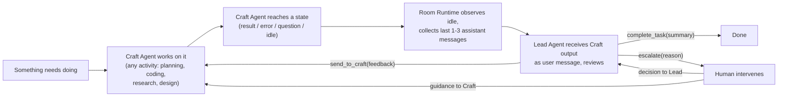
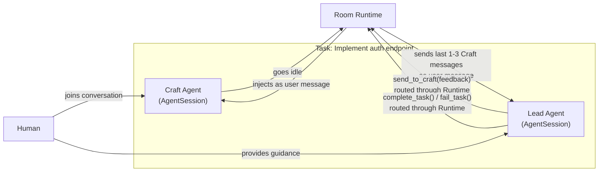
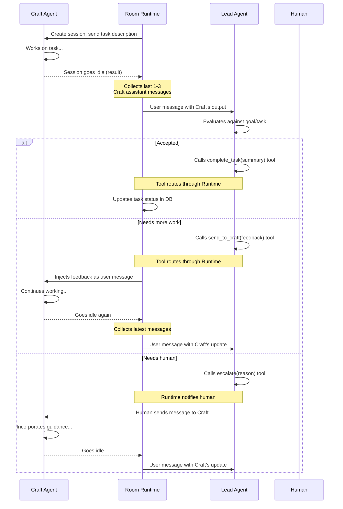
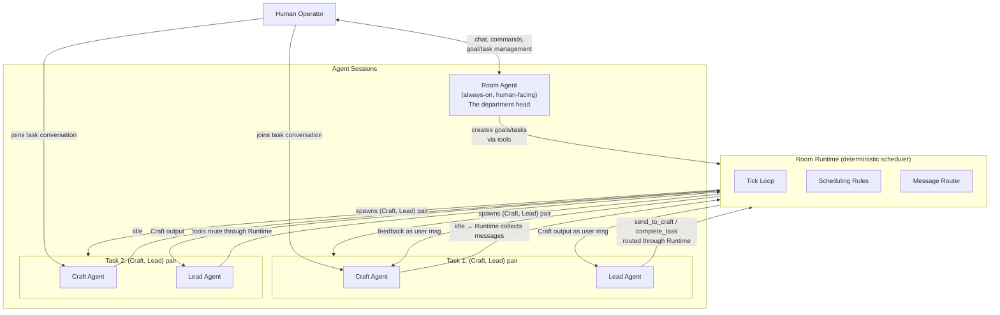
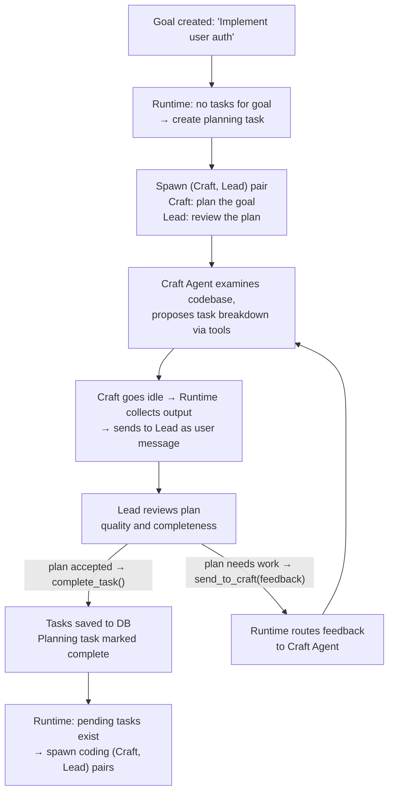

# Room Autonomy Design Spec — Fresh Start

Status: Draft v0.4
Date: 2026-02-23

## Context

NeoKai has a solid human-AI app with multi-session/worktree support. We've been trying to add room autonomy (agents working toward room goals autonomously while allowing human intervention) but the current implementation doesn't work. The architecture drifted from the original "neo" design to a complex "room self agent" design with too many moving parts.

**The core problem**: A room has goals. Work should happen on those goals continuously and autonomously. Humans should be able to intervene at any point.

## Why the Current Design Doesn't Work

The current `RoomSelfService` uses an **LLM as the orchestrator** — a persistent Claude session that receives injected messages and is expected to call tools (`room_create_task`, `room_spawn_worker`, etc.). This fails because:

1. **LLM orchestration is unreliable** — doesn't consistently call the right tools at the right time
2. **Too many states** — 7 lifecycle states with complex transition rules
3. **Double LLM cost** — orchestrator runs constantly alongside workers
4. **Event soup** — complex event subscription/unsubscription patterns
5. **Mixed responsibilities** — ~1300 lines handling everything

## The Fundamental Insight

> A room is like a small organization. You need someone thinking about goals and strategy (high-level), and someone doing the detailed work (execution). No one can hold everything in their head. These two levels need a mechanism to work together.

---

## The Core Abstraction: Craft → Lead Loop

Everything in this system follows the same meta-process. **Planning, coding, researching, designing** — they're all just activities. The abstraction is always the same: one agent crafts, one agent leads and gives feedback.



The **Craft → Lead loop** is universal:

| Activity | Craft Agent does | Lead Agent does |
|---|---|---|
| **Planning** | Examines codebase, proposes task breakdown | Reviews plan quality, suggests adjustments |
| **Coding** | Implements feature, writes tests | Reviews code, checks correctness, requests fixes |
| **Research** | Investigates options, gathers findings | Evaluates findings, asks deeper questions |
| **Design** | Drafts architecture, creates specs | Reviews design, identifies gaps, validates approach |
| **PR Review** | Addresses review comments, pushes fixes | Reads diff, leaves feedback, approves/requests changes |

The loop is always between two parties: a **Craft Agent** and a **Lead Agent**. The Lead can be an agent, a human, or both, or a process involving many parties (like a PR review).

### The (Craft, Lead) Pair

Every task in the system creates a **(Craft, Lead) pair** — two agent sessions that collaborate:



- **Craft Agent**: Full AgentSession with activity-appropriate tools. It does the work and naturally reaches idle when done.
- **Lead Agent**: Full AgentSession that reviews Craft Agent's output. Room Runtime sends the last 1-3 Craft Agent assistant messages as a user message to Lead. Lead evaluates and uses tools to respond.
- **Room Runtime**: All message routing between Craft and Lead goes through Runtime. Runtime observes session state, collects messages, and routes them.
- **Human**: Can participate at any time — send messages to Craft Agent directly, or provide guidance to Lead Agent.

### Message Routing Through Room Runtime

All inter-agent communication is routed through the Room Runtime:



**Why all routing goes through Runtime**:
1. Runtime tracks state — knows when to re-observe Craft's next idle
2. All inter-agent messages flow through one place — auditable
3. Runtime can enforce guard rails (e.g., max feedback iterations)
4. Consistent routing pattern in both directions

### Lead Agent Tools

Lead Agent has a focused tool set, all routed through Room Runtime:

| Tool | Purpose | Runtime action |
|---|---|---|
| `send_to_craft(message)` | Send feedback/follow-up to Craft Agent | Injects as user message into Craft session |
| `complete_task(summary)` | Accept the work, mark task done | Updates task status in DB |
| `fail_task(reason)` | Task is not achievable | Updates task status, notifies Room Agent |
| `escalate(reason)` | Flag for human attention | Notifies human via Room Agent / UI |
| `read_craft_messages(limit)` | Pull more Craft messages beyond what Runtime sent | Returns messages from Craft session |

### Task Chat View: Sub-Agent Blocks

The (Craft, Lead) pair is rendered in the UI as a **single conversation** using **sub-agent blocks**. Each agent's complete turn (thinking + tool uses + result) is grouped into one collapsible block:

```
┌─────────────────────────────────────────────────┐
│ Task: Implement auth endpoint                    │
├─────────────────────────────────────────────────┤
│                                                  │
│ ┌─ 🔨 Craft Agent ────────────────────────────┐ │
│ │ I'll start by examining the existing route   │ │
│ │ structure...                                 │ │
│ │ ▸ Read src/routes/index.ts                   │ │
│ │ ▸ Read src/routes/auth.ts                    │ │
│ │ ▸ Edit src/routes/auth.ts (+42 lines)        │ │
│ │ ▸ Edit src/middleware/validate.ts (+18 lines) │ │
│ │                                              │ │
│ │ Created the POST /api/auth/login endpoint    │ │
│ │ with JWT token generation.                   │ │
│ └──────────────────────────────────────────────┘ │
│                                                  │
│ ┌─ 👁 Lead Agent ─────────────────────────────┐ │
│ │ The endpoint looks good but you missed       │ │
│ │ input validation. Add zod schema validation  │ │
│ │ for the request body.                        │ │
│ │ ▸ send_to_craft("Add zod schema...")         │ │
│ └──────────────────────────────────────────────┘ │
│                                                  │
│ ┌─ 🔨 Craft Agent ────────────────────────────┐ │
│ │ Good catch. Adding zod validation now...     │ │
│ │ ▸ Edit src/routes/auth.ts (+12 lines)        │ │
│ │                                              │ │
│ │ Added zod schema for login request body.     │ │
│ └──────────────────────────────────────────────┘ │
│                                                  │
│ 👤 Human: Also make sure to rate-limit the      │
│    login endpoint                                │
│                                                  │
│ ┌─ 🔨 Craft Agent ────────────────────────────┐ │
│ │ Adding rate limiting...                      │ │
│ │ ▸ Edit src/middleware/rate.ts (+25 lines)     │ │
│ │ ▸ Edit src/routes/auth.ts (+3 lines)         │ │
│ │                                              │ │
│ │ Added rate limiting middleware to the login   │ │
│ │ endpoint (max 5 attempts per minute).        │ │
│ └──────────────────────────────────────────────┘ │
│                                                  │
│ ┌─ 👁 Lead Agent ─────────────────────────────┐ │
│ │ Looks complete. All requirements met.        │ │
│ │ ▸ complete_task("Implemented auth endpoint   │ │
│ │   with JWT, validation, and rate limiting")  │ │
│ └──────────────────────────────────────────────┘ │
│                                                  │
│ ✅ Task completed                                │
└─────────────────────────────────────────────────┘
```

**Rendering rules**:
- **Craft Agent turns** → sub-agent block with 🔨 icon, assistant color scheme. Each complete turn (all thinking + tool uses + result) is one collapsible block.
- **Lead Agent turns** → sub-agent block with 👁 icon, distinct color scheme. Each complete turn is one block.
- **Human messages** → standard user message style (not in a sub-agent block)
- **Turns are interleaved chronologically** from both sessions

**Behind the scenes**:
- Craft Agent session: receives Lead feedback and Human messages as user messages
- Lead Agent session: receives Craft output (last 1-3 assistant messages) as user messages from Runtime
- Human messages to Craft are real user messages in the Craft session
- Lead's `send_to_craft()` tool calls route through Runtime → injected as user messages in Craft session

---

## Design: The Room Runtime

### Architecture Overview



### The Actors

#### 1. Room Runtime (deterministic code — no LLM)

The Room Runtime is the **scheduler and router**. It's a simple loop driven by triggers (timer, events). It makes no decisions about WHAT work to do — it decides WHEN to create (Craft, Lead) pairs, routes messages between them, and executes Lead Agent tool calls.

**Scheduling rules (hardcoded, not LLM-decided)**:
- A goal needs planning when: it's active AND has no pending/in-progress tasks
- A task is ready to execute when: status is `pending`
- Planning is itself a task: "Plan goal X" → creates a (Craft, Lead) pair where Craft Agent plans

**Routing rules**:
- When Craft Agent goes idle → collect last 1-3 assistant messages → send to Lead Agent as user message
- When Lead Agent calls `send_to_craft()` → inject message into Craft Agent session as user message
- When Lead Agent calls `complete_task()` / `fail_task()` → update task in DB → trigger next tick

**State**: `running` | `paused`. That's it.

#### 2. Room Agent (persistent AgentSession — human-facing)

The Room Agent is the **department head**. It's always available for human conversation.

This is a full **AgentSession** with:
- **Tools** for room management: create/update goals, create/update tasks, query room state
- **Access to room context**: goals, tasks, active (Craft, Lead) pairs, room instructions
- **Conversation persisted to DB** (like any other session)
- **Human can chat naturally** — "what's the status?", "prioritize the auth work", "add a goal for..."

The Room Agent is NOT the scheduler. It's the human interface. When the human creates a goal via conversation, the Room Agent calls its tools → data goes to DB → Room Runtime picks it up.

#### 3. Craft Agent (on-demand AgentSession — per task)

The Craft Agent works on a task. It's a standard AgentSession with tools appropriate for the activity:
- **Coding task**: bash, edit, read, write, glob, grep (standard coding tools)
- **Planning task**: read, glob, grep (codebase exploration) + task creation tools
- **Research task**: read, web search, etc.
- **Design task**: read, write (spec writing)

The Craft Agent is a **normal session**. No special tools for signaling completion. When it finishes:
- It reaches **idle state** (result message emitted)
- Or it emits an **error**
- Or it asks a **question** (via AskUserQuestion)

Human can open this session and interact with it directly.

#### 4. Lead Agent (on-demand AgentSession — per task)

The Lead Agent reviews Craft Agent's work. It's a full AgentSession with tools routed through Room Runtime:

| Tool | Purpose |
|---|---|
| `send_to_craft(message)` | Send feedback/follow-up to Craft Agent |
| `complete_task(summary)` | Accept the work, mark task done |
| `fail_task(reason)` | Task is not achievable |
| `escalate(reason)` | Flag for human attention |
| `read_craft_messages(limit)` | Pull more Craft messages if needed |

The Lead Agent is triggered when Room Runtime sends it a user message containing Craft Agent's output. It evaluates the output and uses its tools to respond.

### Planning as a (Craft, Lead) Pair

Planning is not a special actor — it's just another activity for a (Craft, Lead) pair:



### Data Flow: A Complete Cycle


### Human Intervention

Human intervention is NOT a special state. It works at multiple levels:

**Level 1: Room Agent conversation (the department head)**
- "What's the status of the auth feature?"
- "Prioritize the testing tasks"
- "Skip task 3, we don't need it"
- "Add a goal to refactor the database layer"
- "The worker seems stuck, tell it to use JWT instead of sessions"

**Level 2: Direct task participation (join the group chat)**
- Open a task view → see Craft and Lead conversation in sub-agent blocks
- Send a message → goes to Craft Agent as user input
- Human becomes a third participant in the (Craft, Lead) loop

**Level 3: Traditional app controls**
| Action | Effect |
|---|---|
| Pause/Resume runtime | Stops/starts scheduling |
| Add/edit/delete goals | DB changes → Runtime picks up on next tick |
| Add/edit/delete tasks | DB changes → Runtime picks up on next tick |
| Reorder task priority | Affects which task Runtime picks next |

### State Model

**Room Runtime**: `running` | `paused`

**Goals**: `active` | `completed` | `archived`

**Tasks**: `pending` | `in_progress` | `completed` | `failed`

**Task pairs**: Each in-progress task has a (Craft session, Lead session) tracked in DB

No `planning`, `executing`, `reviewing`, `waiting`, `error` states for the room itself.

### When Does the Runtime Tick?

Event-driven with a timer fallback:

1. **Timer**: Every 30-60 seconds (catches anything missed)
2. **Goal created/updated**: Immediate tick
3. **Craft Agent session goes idle**: Immediate tick
4. **Lead Agent tool call executed**: Immediate tick (after `complete_task`, `fail_task`)
5. **Task status changed**: Immediate tick

Each tick runs the same deterministic logic. No special handling per trigger type.

### Error Handling

- **Craft Agent session errors**: Runtime sends error to Lead Agent → Lead decides: retry, adjust, or escalate.
- **Lead Agent session fails**: Log error, retry on next tick. Craft output stays pending review.
- **Too many consecutive errors**: Runtime pauses itself, notifies human via Room Agent.

All errors are recoverable by re-running the tick. No stuck states.

### Capacity Management

- `maxConcurrentPairs`: configurable per room (default: 1 for MVP)
- Runtime only spawns (Craft, Lead) pairs when below capacity
- Tasks execute sequentially (MVP)

---

## What We Reuse

- **AgentSession infrastructure** — for ALL agents (Room Agent, Craft, Lead)
- **Session persistence** — all conversations stored in DB automatically
- **Sub-agent block UI components** — already exist, used for Task Chat View
- **Database schema** — rooms, goals, tasks tables
- **DaemonHub events** — for session state change observations
- **MessageHub** — for UI communication

## What We Replace

- **RoomSelfService** → new `RoomRuntime` (deterministic scheduler + router)
- **Room agent tools MCP** → new Room Agent tools (goal/task CRUD, room state queries)
- **RoomSelfLifecycleManager** → not needed (only 2 states)
- **Worker tools (worker_complete_task etc.)** → Lead Agent tools instead
- **WorkerManager** → replaced by (Craft, Lead) pair manager

## New Components

1. **RoomRuntime** — deterministic scheduler loop + message router
2. **Room Agent tools** — MCP tools for goal/task CRUD, room state queries
3. **Lead Agent tools** — MCP tools: `send_to_craft`, `complete_task`, `fail_task`, `escalate`, `read_craft_messages`
4. **Task pair manager** — creates and tracks (Craft, Lead) pairs for tasks
5. **Session observer** — detects when Craft / Lead sessions go idle/error
6. **Task Chat View UI** — unified chat rendering with sub-agent blocks for (Craft, Lead, Human)

## Design Decisions (Resolved)

1. **Task execution**: Sequential only. One (Craft, Lead) pair at a time (MVP).
2. **Review policy**: Every Craft Agent idle/result triggers Lead Agent review via Runtime.
3. **Planning is a task**: Not a special actor. Planning creates a (Craft, Lead) pair like any other task.
4. **All agents are AgentSessions**: Room Agent, Craft, Lead all reuse existing session infrastructure. All conversations persisted.
5. **Craft Agents are normal sessions**: No special signaling tools. They just work and go idle.
6. **Lead Agent tools route through Runtime**: `send_to_craft`, `complete_task`, etc. all go through Runtime for consistent routing, tracking, and guard rails.
7. **Runtime collects messages**: When Craft goes idle, Runtime collects last 1-3 assistant messages and sends to Lead as a user message.
8. **Human interface**: Room Agent is always-on department head. Humans can also join any task's group chat.
9. **Task Chat View**: (Craft, Lead) pair rendered as unified conversation with sub-agent blocks per turn.
10. **Naming**: Craft Agent (does the work) + Lead Agent (reviews and directs).

## Open Questions (For Future Iterations)

1. **Parallel (Craft, Lead) pairs**: Multiple pairs for different tasks/goals. Not MVP.
2. **Multi-reviewer**: Multiple Lead Agents with different models reviewing the same work (consensus-based review). The Craft→Lead loop supports this naturally.
3. **Room Agent as Lead**: Should the Room Agent serve as Lead for tasks, or should each task get its own dedicated Lead? Trade-off: shared context vs. isolation.
4. **Cross-task context**: Should a subsequent Craft Agent get context from previous tasks' sessions?
5. **External review integration**: PR reviews, CI results as input to Lead Agent.

---

## Implementation Plan

### Phase 1: Foundation
- RoomRuntime scheduler loop + message router
- Session observation (detect idle/error)
- Room Agent with goal/task management tools

### Phase 2: Craft → Lead Loop
- Task pair manager (create Craft + Lead sessions per task)
- Lead Agent tools (`send_to_craft`, `complete_task`, `fail_task`, `escalate`, `read_craft_messages`)
- Runtime message collection (Craft idle → collect messages → send to Lead)
- Runtime message routing (Lead `send_to_craft()` → inject into Craft session)
- Integration test: task → Craft works → Lead reviews → feedback loop → accepted

### Phase 3: Planning as a Task
- Planning (Craft, Lead) pair for goal decomposition
- Full cycle test: goal → plan → tasks → execute → review → complete

### Phase 4: Human Intervention
- Room Agent conversation flows
- Human joins task group chat (message routing)
- Pause/resume, task editing

### Phase 5: Task Chat View UI
- Sub-agent blocks for Craft turns (🔨) and Lead turns (👁)
- Human messages rendered inline
- Chronological interleaving from both sessions
- Task controls within the view

### Verification (end-to-end acceptance criteria)
- Create a room, chat with Room Agent: "Add a health check endpoint to the API"
- Room Agent creates goal → Runtime creates planning task → plan reviewed → coding tasks created
- Runtime spawns (Craft, Lead) pair → Craft codes → Lead reviews → iterates → accepts
- Repeat for remaining tasks → goal marked complete
- Human can: pause, chat with Room Agent, join task group chat, edit tasks
- Add another goal and verify continuous operation
- Restart daemon mid-execution and verify recovery (no stuck states)
