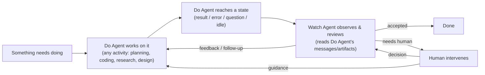
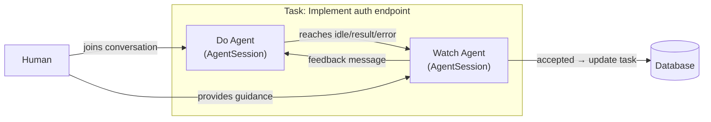
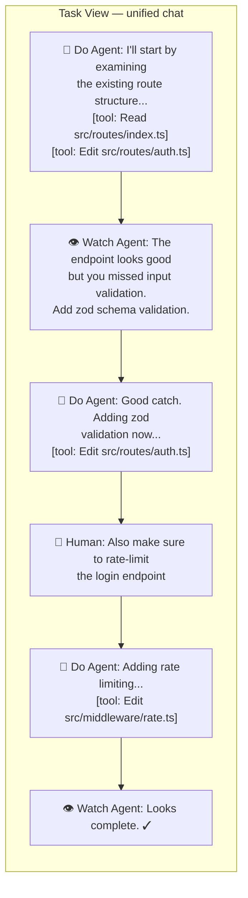
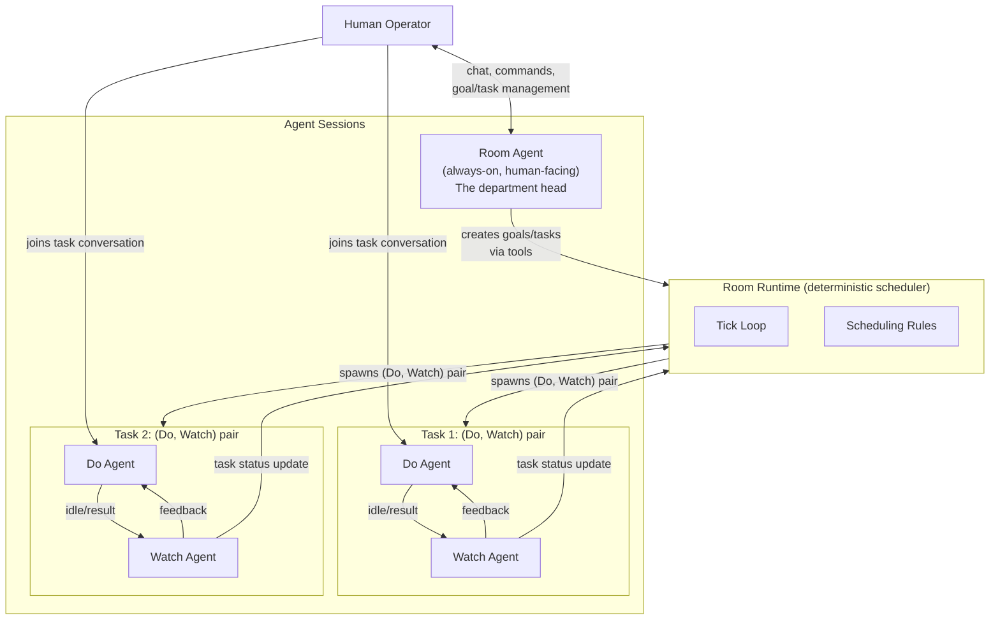
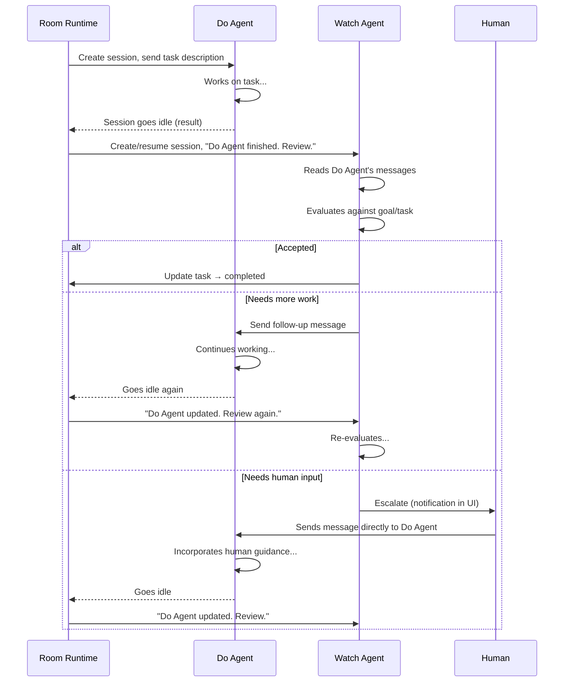
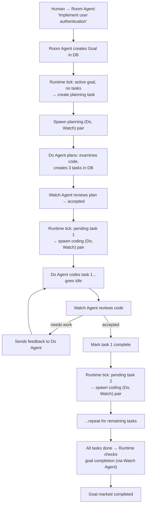

# Room Autonomy Design Spec — Fresh Start

Status: Draft v0.3
Date: 2026-02-23

## Context

NeoKai has a solid human-AI app with multi-session/worktree support. We've been trying to add room autonomy (agents working toward room goals autonomously while allowing human intervention) but the current implementation doesn't work. The architecture drifted from the original "neo" design to a complex "room self agent" design with too many moving parts.

**The core problem**: A room has goals. Work should happen on those goals continuously and autonomously. Humans should be able to intervene at any point.

## Why the Current Design Doesn't Work

The current `RoomSelfService` uses an **LLM as the orchestrator** — a persistent Claude session that receives injected messages and is expected to call tools (`room_create_task`, `room_spawn_worker`, etc.). This fails because:

1. **LLM orchestration is unreliable** — doesn't consistently call the right tools at the right time
2. **Too many states** — 7 lifecycle states with complex transition rules
3. **Double LLM cost** — orchestrator runs constantly alongside workers
4. **Event soup** — complex event subscription/unsubscription patterns
5. **Mixed responsibilities** — ~1300 lines handling everything

## The Fundamental Insight

> A room is like a small organization. You need someone thinking about goals and strategy (high-level), and someone doing the detailed work (execution). No one can hold everything in their head. These two levels need a mechanism to work together.

---

## The Core Abstraction: Do → Watch Loop

Everything in this system follows the same meta-process. **Planning, coding, researching, designing** — they're all just activities. The abstraction is always the same: one agent does, one agent watches and gives feedback.



The **Do → Watch loop** is universal:

| Activity | Do Agent does | Watch Agent does |
|---|---|---|
| **Planning** | Examines codebase, proposes task breakdown | Reviews plan quality, suggests adjustments |
| **Coding** | Implements feature, writes tests | Reviews code, checks correctness, requests fixes |
| **Research** | Investigates options, gathers findings | Evaluates findings, asks deeper questions |
| **Design** | Drafts architecture, creates specs | Reviews design, identifies gaps, validates approach |
| **PR Review** | Addresses review comments, pushes fixes | Reads diff, leaves feedback, approves/requests changes |

The loop is always between two parties: a **doer** and a **watcher**. The watcher can be an agent, a human, or both, or a process that can be involved by many parties (like a PR review).

### The (Do, Watch) Pair

Every task in the system creates a **(Do, Watch) pair** — two agent sessions that collaborate:



- **Do Agent**: Full AgentSession with activity-appropriate tools. It does the work and naturally reaches idle when done.
- **Watch Agent**: Full AgentSession that observes Do Agent's session. When Do Agent goes idle, Watch Agent pulls its messages, evaluates the output, and either sends feedback (as a user message to Do Agent) or accepts the work.
- **Human**: Can participate at any time — send messages to Do Agent directly, or provide guidance to Watch Agent.

Behind the scenes, these are two separate sessions. But the **Task View** unifies them.

### Task View: Group Chat UI

The (Do, Watch) pair is rendered in the UI as a **single conversation** — a group chat with three possible participants:



**Rendering rules**:
- **Do Agent messages** → assistant message style (tool uses visible)
- **Watch Agent messages** → distinct style (visually different from both human and Do Agent)
- **Human messages** → standard user message style
- Messages are **interleaved chronologically** from both sessions

**Behind the scenes**:
- Do Agent session: receives Watch Agent feedback and Human messages as user messages
- Watch Agent session: receives Do Agent output as context, human guidance as user messages
- Human messages to Do Agent are real user messages to the Do Agent session
- Watch Agent sends follow-ups to Do Agent as synthetic user messages

---

## Design: The Room Runtime

### Architecture Overview



### The Actors

#### 1. Room Runtime (deterministic code — no LLM)

The Room Runtime is the **scheduler**. It's a simple loop driven by triggers (timer, events). It makes no decisions about WHAT work to do — it decides WHEN to create (Do, Watch) pairs and HOW to route information.

**Rules (hardcoded, not LLM-decided)**:
- A goal needs planning when: it's active AND has no pending/in-progress tasks
- A task is ready to execute when: status is `pending`
- Planning is itself a task: "Plan goal X" → creates a (Do, Watch) pair where the Do Agent plans

**State**: `running` | `paused`. That's it.

#### 2. Room Agent (persistent AgentSession — human-facing)

The Room Agent is the **department head**. It's always available for human conversation.

This is a full **AgentSession** with:
- **Tools** for room management: create/update goals, create/update tasks, query room state
- **Access to room context**: goals, tasks, active (Do, Watch) pairs, room instructions
- **Conversation persisted to DB** (like any other session)
- **Human can chat naturally** — "what's the status?", "prioritize the auth work", "add a goal for..."

The Room Agent is NOT the scheduler. It's the human interface. When the human creates a goal via conversation, the Room Agent calls its tools → data goes to DB → Room Runtime picks it up.

The Room Agent could also act as the Watch Agent for certain tasks — but this is a design choice per task, not a hardcoded rule.

#### 3. Do Agent (on-demand AgentSession — per task)

The Do Agent works on a task. It's a standard AgentSession with tools appropriate for the activity:
- **Coding task**: bash, edit, read, write, glob, grep (standard coding tools)
- **Planning task**: read, glob, grep (codebase exploration) + task creation tools
- **Research task**: read, web search, etc.
- **Design task**: read, write (spec writing)

The Do Agent is a **normal session**. No special tools for signaling completion. When it finishes:
- It reaches **idle state** (result message emitted)
- Or it emits an **error**
- Or it asks a **question** (via AskUserQuestion)

Human can open this session and interact with it directly.

#### 4. Watch Agent (on-demand AgentSession — per task)

The Watch Agent observes and reviews the Do Agent's work. It's a full AgentSession with:
- **Tool to read Do Agent's session messages** — pull the latest messages/artifacts
- **Tool to send message to Do Agent** — inject a follow-up as a user message
- **Tool to update task status** — mark task completed/failed
- **Tool to escalate to human** — flag for human attention
- **Access to goal context** — understands what the task is trying to achieve

The Watch Agent is triggered by the Room Runtime when the Do Agent goes idle. It reads the Do Agent's output, evaluates it, and decides: send feedback, accept, or escalate.

### How the (Do, Watch) Loop Works



### Planning as a (Do, Watch) Pair

Planning is not a special actor — it's just another activity for a (Do, Watch) pair:

```mermaid
graph TD
    A[Goal created: 'Implement user auth'] --> B[Runtime: no tasks for goal<br/>→ create planning task]
    B --> C["Spawn (Do, Watch) pair<br/>Do Agent: plan the goal<br/>Watch Agent: review the plan"]
    C --> D[Do Agent examines codebase,<br/>proposes task breakdown via tools]
    D --> E[Watch Agent reviews plan<br/>quality and completeness]
    E -->|"plan accepted"| F[Tasks saved to DB<br/>Planning task marked complete]
    E -->|"plan needs work"| G[Watch Agent sends feedback]
    G --> D
    F --> H[Runtime: pending tasks exist<br/>→ spawn coding (Do, Watch) pairs]
```

The Do Agent for planning has tools to:
- Read codebase files
- Create tasks in DB
- Query existing goals/tasks

The Watch Agent for planning evaluates whether the task breakdown is sensible, complete, and actionable.

### Data Flow: A Complete Cycle



### Human Intervention

Human intervention is NOT a special state. It works at multiple levels:

**Level 1: Room Agent conversation (the department head)**
- "What's the status of the auth feature?"
- "Prioritize the testing tasks"
- "Skip task 3, we don't need it"
- "Add a goal to refactor the database layer"
- "The worker seems stuck, tell it to use JWT instead of sessions"

**Level 2: Direct task participation (join the group chat)**
- Open a task view → see Do Agent and Watch Agent conversation
- Send a message → goes to Do Agent as user input
- Human becomes a third participant in the (Do, Watch) loop

**Level 3: Traditional app controls**
| Action | Effect |
|---|---|
| Pause/Resume runtime | Stops/starts scheduling |
| Add/edit/delete goals | DB changes → Runtime picks up on next tick |
| Add/edit/delete tasks | DB changes → Runtime picks up on next tick |
| Reorder task priority | Affects which task Runtime picks next |

### State Model

**Room Runtime**: `running` | `paused`

**Goals**: `active` | `completed` | `archived`

**Tasks**: `pending` | `in_progress` | `completed` | `failed`

**Task pairs**: Each in-progress task has a (Do session, Watch session) tracked in DB

No `planning`, `executing`, `reviewing`, `waiting`, `error` states for the room itself.

### When Does the Runtime Tick?

Event-driven with a timer fallback:

1. **Timer**: Every 30-60 seconds (catches anything missed)
2. **Goal created/updated**: Immediate tick
3. **Do Agent session goes idle**: Immediate tick
4. **Task status changed**: Immediate tick

Each tick runs the same deterministic logic. No special handling per trigger type.

### Error Handling

- **Do Agent session errors**: Watch Agent reviews the error and decides: retry, adjust approach, or escalate.
- **Watch Agent session fails**: Log error, retry on next tick. Do Agent output stays pending review.
- **Too many consecutive errors**: Runtime pauses itself, notifies human via Room Agent.

All errors are recoverable by re-running the tick. No stuck states.

### Capacity Management

- `maxConcurrentWorkers`: configurable per room (default: 1 for MVP)
- Runtime only spawns (Do, Watch) pairs when below capacity
- Tasks execute sequentially (MVP)

---

## What We Reuse

- **AgentSession infrastructure** — for ALL agents (Room Agent, Do Agents, Watch Agents)
- **Session persistence** — all conversations stored in DB automatically
- **Database schema** — rooms, goals, tasks tables
- **DaemonHub events** — for session state change observations
- **MessageHub** — for UI communication

## What We Replace

- **RoomSelfService** → new `RoomRuntime` (deterministic scheduler)
- **Room agent tools MCP** → new Room Agent tools (goal/task CRUD, room state queries)
- **RoomSelfLifecycleManager** → not needed (only 2 states)
- **Worker tools (worker_complete_task etc.)** → not needed (session observation + Watch Agent instead)
- **WorkerManager** → simplified or replaced by (Do, Watch) pair manager

## New Components

1. **RoomRuntime** — deterministic scheduler loop
2. **Room Agent tools** — MCP tools for goal/task CRUD, room state queries
3. **Watch Agent tools** — MCP tools to read Do Agent messages, send follow-ups, update task status
4. **Task pair manager** — creates and tracks (Do, Watch) pairs for tasks
5. **Session observer** — detects when Do Agent / Watch Agent sessions go idle/error
6. **Task View UI** — unified chat rendering of (Do, Watch, Human) messages

## Design Decisions (Resolved)

1. **Task execution**: Sequential only. One (Do, Watch) pair at a time (MVP).
2. **Review policy**: Every Do Agent idle/result triggers Watch Agent review.
3. **Planning is a task**: Not a special actor. Planning creates a (Do, Watch) pair like any other task.
4. **All agents are AgentSessions**: Room Agent, Do Agents, Watch Agents all reuse existing session infrastructure. All conversations persisted.
5. **No special worker tools**: Do Agents are normal sessions. Watch Agents handle the review/feedback loop.
6. **Human interface**: Room Agent is always-on department head. Humans can also join any task's group chat.
7. **Task View**: (Do, Watch) pair rendered as unified group chat in UI.

## Open Questions (For Future Iterations)

1. **Parallel (Do, Watch) pairs**: Multiple pairs for different tasks/goals. Not MVP.
2. **Multi-reviewer**: Multiple Watch Agents with different models reviewing the same work (consensus-based review). The do→watch loop supports this naturally.
3. **Watch Agent as Room Agent**: Should the Room Agent serve as Watch Agent for tasks, or should each task get its own dedicated Watch Agent? Trade-off: shared context vs. isolation.
4. **Cross-task context**: Should a subsequent Do Agent get context from previous tasks' sessions?
5. **External review integration**: PR reviews, CI results as input to Watch Agent.

---

## Implementation Plan

### Phase 1: Foundation
- RoomRuntime scheduler loop
- Session observation (detect idle/error)
- Room Agent with goal/task management tools

### Phase 2: Do → Watch Loop
- Task pair manager (create Do + Watch sessions per task)
- Watch Agent tools (read Do messages, send follow-ups, update task status)
- Integration test: task → Do Agent works → Watch Agent reviews → feedback loop → accepted

### Phase 3: Planning as a Task
- Planning (Do, Watch) pair for goal decomposition
- Full cycle test: goal → plan → tasks → execute → review → complete

### Phase 4: Human Intervention
- Room Agent conversation flows
- Human joins task group chat
- Pause/resume, task editing

### Phase 5: Task View UI
- Unified chat rendering of (Do, Watch, Human) messages
- Visual differentiation of message sources
- Task controls within the view

### Verification (end-to-end acceptance criteria)
- Create a room, chat with Room Agent: "Add a health check endpoint to the API"
- Room Agent creates goal → Runtime creates planning task → plan reviewed → coding tasks created
- Runtime spawns (Do, Watch) pair → Do Agent codes → Watch Agent reviews → iterates → accepts
- Repeat for remaining tasks → goal marked complete
- Human can: pause, chat with Room Agent, join task group chat, edit tasks
- Add another goal and verify continuous operation
- Restart daemon mid-execution and verify recovery (no stuck states)
