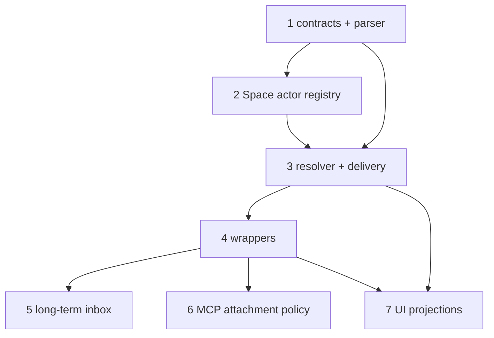

# Space Actor Communication Design

Status: Proposed
Date: 2026-05-16
Task: #401 — Design universal Space actor communication model

## Summary

Use a small actor-addressed messaging substrate for the Space features we already have:

- Space chat / Coordinator
- ad-hoc Space sessions
- current task messaging compatibility
- workflow node agent messaging
- pending worker delivery
- role escalation such as task-manager

The substrate should be generic enough to support long-term agents, inter-Space communication, and
inter-domain communication later, but v1 should not introduce a full Slack clone or task/workflow
chat threads.

## Core decision

Build one generic **Messaging** service/package boundary, then adapt Space to it.

Recommended boundary:

- `packages/messaging` or equivalent daemon-internal package first if package split is too early.
- Owns protocol types, address parsing, resolver contracts, message/delivery shapes, and audit event
  shapes.
- Does not own Space-specific storage, workflow activation, gates, or UI policy.
- Space runtime implements domain adapters: actor resolver, permission checks, delivery executor, and
  activation hooks.

This avoids baking generic actor messaging into `packages/daemon/src/lib/space/*` and keeps future
inter-Space / inter-domain routing from requiring a ground-up rewrite.

## What v1 must cover

Current behavior must keep working:

| Current feature | v1 generic mapping |
| --- | --- |
| Space Agent / default space chat agent | `agent` actor with `coordinator` role and `@coordinator` handle |
| Human Space chat / ad-hoc session | `session` actor with `@session:<id>` address |
| New persistent role agents | `agent` actor with handle and optional roles |
| Workflow node agent / coder / reviewer | `worker` actor, scoped by `workflowRunId` + `nodeId` + `agentName` |
| `node-agent send_message` | wrapper around generic `send_message` |
| task message RPC/tooling | compatibility wrapper around generic `send_message` |
| `pending_agent_messages` | delivery rows / queue with same retry, TTL, terminal state |
| task/workflow message UI | projection of messages/events; not LLM chat thread |

## Non-goals for v1

Do not build these now:

- Full channel system beyond existing Space/session/task surfaces.
- Public `conversation:<id>` target syntax.
- Task threads or workflow threads as LLM-visible chat surfaces.
- Cross-Space delivery implementation.
- Cross-domain delivery implementation.
- General federation, external identity proof, or trust negotiation.

Design data shapes so those can be added later through adapters.

## Minimal concepts

### Actor

Actor = addressable identity.

```ts
type ActorKind = 'human' | 'session' | 'agent' | 'worker' | 'system';

type ActorRef = {
	actorId: string;
	kind: ActorKind;
	spaceId: string;
	handle?: string; // @coordinator, @task-manager
	roles?: string[]; // coordinator, task-manager, reviewer
	status: 'active' | 'inactive' | 'archived' | 'deleted';
};
```

Notes:

- `agent` covers persistent non-human Space actors. Coordinator is an agent role/handle, not a separate
  kind: `{ kind: 'agent', handle: '@coordinator', roles: ['coordinator'] }`.
- `archived`: no new routing; stays visible in history.
- `deleted`: soft-delete for privacy/admin removal; no routing/lookup/autocomplete; history keeps actor
  ID with redacted display metadata.
- Worker actors are identity-scoped by `(workflowRunId, nodeId, agentName)`. `nodeId` alone is not enough:
  one workflow node can host multiple agent slots with independent inbox, retry, and delivery state.
- Worker aliases like `@coder` and `@review` are contextual only. Do not register them as global Space
  handles. Globally addressable workers use exact worker-slot addresses such as `@worker:<run>/<node>/<agent>`.

### Address syntax

Keep v1 syntax small:

| Syntax | Meaning | Example |
| --- | --- | --- |
| `@handle` | Actor handle in current Space | `@coordinator`, `@task-manager` |
| `@role:<role>` | Role binding in current Space | `@role:task-manager` |
| `@session:<id>` | Space session actor | `@session:abc123` |
| `@worker:<node>` | Worker node in current workflow context; valid only when node has one agent slot or caller context selects the slot | `@worker:Review` |
| `@worker:<node>/<agent>` | Exact worker slot in current workflow context | `@worker:Review/reviewer` |
| `@worker:<run>/<node>/<agent>` | Exact worker slot in explicit workflow run | `@worker:f1089/Review/reviewer` |
| `#<name>` | Optional channel/topic handle if enabled | `#deployments` |

Do not expose these as target syntax in v1:

- `session:<id>` — ambiguous with `@session:<id>`.
- `conversation:<id>` — too low-level for agents/users.
- `task:<id>` / `workflow:<id>` — context only, not deliverable targets.

If a caller must continue an existing conversation, use fields, not target syntax:

```ts
send_message({
	target: '@session:abc123',
	conversationId: 'conv_789',
	body: 'Following up here',
});
```

### Context

Task/workflow/session IDs are context and audit metadata, not chat targets.

```ts
type MessageContext = {
	spaceId: string;
	taskId?: string;
	workflowRunId?: string;
	nodeId?: string;
	sessionId?: string;
	agentName?: string;
	originMessageId?: string;
	originConversationId?: string;
};
```

Use context for:

- authorization
- worker alias resolution
- pending delivery lookup
- audit
- UI badges / task timeline projection
- reply routing

### Message

```ts
type MessageKind =
	| 'chat'
	| 'question'
	| 'answer'
	| 'blocked'
	| 'handoff'
	| 'approval_request'
	| 'approval_result'
	| 'system_event';

type MessageAttachment = {
	id?: string;
	type: 'image' | 'file' | 'url';
	mimeType?: string;
	name?: string;
	url?: string;
	storageKey?: string;
};

type MessageRecord = {
	messageId: string;
	spaceId: string;
	senderActorId: string;
	targets: string[]; // raw target strings after wrapper translation
	body: string;
	kind: MessageKind;
	context: MessageContext;
	conversationId?: string;
	replyToMessageId?: string;
	attachments?: MessageAttachment[];
	data?: Record<string, unknown>; // structured gate/vote/approval payload
	idempotencyKey?: string;
	createdAt: number;
};
```

`data` is required for compatibility with current `node-agent send_message({ data })`: gated channel
payloads are merged into gate state today and must keep working after cutover. `attachments` preserves
current human task messaging images/files instead of forcing a side channel. `idempotencyKey` is
persisted on the message, but dedupe is evaluated per resolved recipient target/delivery, not per sender
message. For legacy pending worker delivery this preserves the current
`(workflowRunId, targetAgentName, idempotencyKey)` behavior: retrying the same delivery suppresses a
pending duplicate for that recipient, while multicast/broadcast can still create legitimate deliveries to
other recipients using the same key.

### Delivery

One message can create many deliveries.

```ts
type DeliveryState = 'queued' | 'delivered' | 'failed' | 'expired' | 'skipped';

type DeliveryRecord = {
	deliveryId: string;
	messageId: string;
	/** Present after resolution succeeds; absent for unresolved fallback/error audit rows. */
	targetActorId?: string;
	/** Raw or translated target this delivery represents, for audit and unresolved failures. */
	targetRef: string;
	state: DeliveryState;
	attemptCount: number;
	maxAttempts: number;
	expiresAt?: number;
	lastError?: string;
	deliveredSessionId?: string;
	deliveredAt?: number;
};
```

`pending_agent_messages` migration:

- legacy `pending` → `queued`
- legacy `delivered` → `delivered`
- legacy `failed` → `failed`
- legacy `expired` → `expired`
- preserve attempts, max attempts, TTL, last error, delivered session ID

## Resolution rules

Keep resolver deterministic:

1. Parse target string.
2. Apply current Space/domain context.
3. Resolve exact `@handle` among routable actors: `active` delivers immediately; `inactive` can create
   queued delivery if activation/retry policy exists; `archived`/`deleted` do not route.
4. Resolve `@role:<role>` using role binding.
5. Resolve `@session:<id>` to session actor if session is user-facing/ad-hoc.
6. Resolve `@worker:<node>` using `workflowRunId` plus current `agentName` context, or only if that
   node has one routable agent slot.
7. Resolve `@worker:<node>/<agent>` using `workflowRunId` from context.
8. Resolve `@worker:<run>/<node>/<agent>` if sender can access that run.
9. Resolve optional `#<name>` channel/topic if enabled.
10. If caller omitted `target`, use current context fallback (`@coordinator`, `@role:task-manager`,
    explicit worker from task/workflow context, or triage channel).
11. If caller provided an explicit target and it does not resolve, return an error. Do not silently
    fallback; typos and stale handles must not leak content to another actor.
12. If fallback target cannot resolve, create a failed delivery/audit row with `targetRef` set to the
    attempted fallback string and no `targetActorId`, then return an explicit error.

Important seeding rule:

- Session actors only come from ad-hoc human/member sessions.
- Exclude `space_chat`, removed/legacy `space_task_agent`, and workflow sub-sessions.
- Coordinator uses the agent-role path; no new design should depend on built-in task-agent helper behavior.

## API shape

### `send_message`

```ts
type SendMessageInput = {
	/** Optional only for context-fallback paths; explicit callers should pass a target. */
	target?: string | string[];
	body: string;
	kind?: MessageKind;
	context?: Partial<MessageContext>;
	conversationId?: string;
	replyToMessageId?: string;
	attachments?: MessageAttachment[];
	data?: Record<string, unknown>;
	idempotencyKey?: string;
};

type SendMessageResult = {
	messageId: string;
	deliveries: DeliveryRecord[];
	fallbackUsed?: string;
};
```

### Other v1 tools

Minimal set:

- `send_message`
- `resolve_address`
- `list_actors`
- `read_messages` / `read_conversation` if UI/agent needs history
- Defer `mark_handled` until delivery records grow read/handled timestamps; v1 keeps delivery state to queue/delivery outcomes.

Do not add a full conversation management API until product needs it.

## Compatibility wrappers

### `node-agent-tools.send_message`

Maps current workflow messaging into `send_message`:

```ts
const translatedTargets = translateLegacyNodeTargets(target, {
	spaceId,
	taskId,
	workflowRunId,
	nodeId,
	agentName,
});

send_message({
	target: translatedTargets,
	body: message,
	kind: messageKind ?? 'chat',
	data,
	context: { spaceId, taskId, workflowRunId, nodeId, agentName },
});
```

Preserve:

- channel topology permissions
- gated channel payload merge from `data`
- queued delivery for inactive target sessions
- activation hooks
- broadcast, multicast array, reserved `space-agent`, node-name, and agent-name resolution where supported today

Legacy node targets must be translated before calling generic `send_message`:

| Legacy target | Generic target |
| --- | --- |
| `'*'` | expand before send to topology-permitted exact worker-slot targets `@worker:<run>/<node>/<agent>` |
| `string[]` multicast | translate each element independently with these rules, flatten, and de-dupe by recipient target |
| `space-agent` | reserved compatibility target; route to Coordinator / Space Agent actor (`@coordinator`) |
| `task-agent` | removed legacy target; reject explicitly or map only in temporary migration shims for old queued rows, never as a worker alias |
| bare agent name | resolve through workflow topology/node executions to matching `(nodeId, agentName)`, then format exact worker-slot target |
| bare node name | resolve node; if one agent slot, format exact worker-slot target; if multiple slots, use caller context or require an exact slot |
| already generic `@...` / `#...` | pass through |

### Task message compatibility wrapper

Preserve current post-task-agent behavior:

- Task/workflow IDs remain context, not message targets.
- If caller passes node ID, explicit actor, or role target, deliver to that worker/role/session.
- If caller only passes task ID/number, use the current default task routing path from task context
  (usually Coordinator, task-manager role, or active worker chosen by task state), not the removed
  built-in task-agent helper.
- Reject removed legacy `task-agent` targets for new calls; keep only narrow migration handling for old
  queued rows if storage still contains them.
- Mark wrapper deprecated after generic tool adoption.

### Human task message RPC

Routes to explicit worker/role/session when mentioned; otherwise uses the same current default task
routing path as the compatibility wrapper.

## Package / implementation shape

Recommended split:

```text
packages/messaging/                 # or daemon-internal equivalent first
  src/types.ts                       # ActorRef, MessageRecord, DeliveryRecord
  src/address.ts                     # parse/format target strings
  src/contracts.ts                   # resolver/router/storage interfaces

packages/daemon/src/lib/space/
  messaging-adapter.ts               # Space actor resolver + policy + delivery executor
  tools/*                            # MCP wrappers call generic service
  runtime/*                          # workflow activation/gates remain here
```

Do not move SQLite schema or runtime activation into generic package. Generic package should define
contracts and pure helpers; daemon owns persistence/execution.

## Future extension points

### Inter-Space

Do not implement now. Future adapter can wrap the same message shape in a remote envelope:

```ts
type RemoteEnvelope = {
	originSpaceId: string;
	targetSpaceId: string;
	originActorId: string;
	target: string;
	message: MessageRecord;
	trustLevel: 'local' | 'same_org' | 'external';
	correlationId: string;
};
```

Future syntax can be added without changing core records:

- `space:<spaceId>::@handle`
- `space:<spaceId>::@role:<role>`
- `space:<spaceId>::#channel`

Until adapter exists, reject these explicitly. Never fallback to local handles.

### Inter-domain

Same model, different adapter. Examples:

- GitHub issue/PR comment actor
- Slack user/channel
- support ticket thread
- external automation bot

Future syntax:

- `domain:github::@release-bot`
- `domain:github::conversation:pr-1920`

Domain adapter owns identity proof, permission, rate limits, and external audit mapping.

### Task timeline and workflow execution log

Task/workflow are not chat targets. Future UI may add projections:

- **Task timeline**: human-readable task feed of decisions, questions, answers, artifacts, and status.
- **Workflow execution log**: runtime feed of node handoffs, gate writes, queued delivery, retries, CI,
  artifacts, and system events.

These surfaces reference messages/events. They do not own reply routing and are not injected wholesale
into LLM context.

## Migration plan

1. Add generic messaging types/address parser/contracts.
2. Seed minimal actor registry:
   - Human actors from Space membership/users.
   - Coordinator from current Space Agent / `space_chat` default session.
   - Session actors from ad-hoc human/member sessions only.
   - Agent actors for long-term agents when they exist.
   - Worker actors from active and declared workflow node executions, including inactive workers
     referenced by pending rows.
   - System actors for runtime subsystems.
3. Implement Space adapter resolver and delivery writer.
4. Map `pending_agent_messages` into delivery rows/facade.
5. Wrap `node-agent send_message` and preserve gate `data` behavior.
6. Wrap current task message RPC/tooling and preserve task-only default routing through Coordinator,
   task-manager role, or task-state-selected worker.
7. Update Space MCP attachment by explicit actor/session role:
   - `space_chat` / Coordinator gets generic messaging + management.
   - ad-hoc Space sessions get generic messaging.
   - workflow workers get generic messaging through node wrapper.
   - removed/legacy `space_task_agent` sessions are excluded; no new attachment path depends on them.
8. Keep only narrow migration handling for old task-agent queued rows if present; do not design new flows
   around the removed helper.

## Follow-up implementation tasks

1. **Add generic messaging contracts and address parser**
   - Minimal types, parser, resolver/router/storage interfaces.

2. **Add Space actor registry adapter**
   - Depends on task 1.
   - Seed Coordinator, Human, Session, Worker, System actors using current data.

3. **Implement Space resolver and delivery facade**
   - Depends on tasks 1 and 2.
   - Preserve current workflow routing and pending delivery semantics.

4. **Wrap existing MCP/RPC tools**
   - Depends on task 3.
   - `node-agent send_message`, current task message RPC/tooling, human task message RPC.

5. **Add long-term agent inbox / DM activation**
   - Depends on task 4.
   - Enables agent ↔ agent and session ↔ agent messaging.

6. **Refactor Space MCP attachment by actor/session role**
   - Depends on task 4.
   - Replace broad `context.spaceId` sweeps and skip guards with explicit policy.

7. **Add UI projections**
   - Depends on tasks 3 and 4.
   - Actor labels, target resolution badges, delivery state, task timeline projection.

Dependency graph:



## Updates to draft tasks

### #398 — Untangle Space MCP ownership by session role

Keep, but scope it after generic messaging wrapper work. Replace current skip mechanisms with explicit
actor/session-role policy:

- `session.type === 'space_chat'`
- removed/legacy `session.type === 'space_task_agent'` if older databases or sessions still contain it
- workflow sub-session ID checks using `:task:` + `:exec:`

Do not treat `:agent:` as a guard; it is session ID construction.

### #399 — Fix Space ad-hoc session MCP reattach after daemon restart

If urgent, keep tactical fix now. Long-term fix becomes role-based attachment using actor/session
policy.

### #400 — Remove built-in task-agent LLM helper from Space workflows

Superseded by current `dev`: built-in task-agent helper has already been removed. Update remaining work:

- keep generic messaging wrappers aligned with current task message RPC/tooling
- route task-only/default messaging through Coordinator, task-manager role, or task-state-selected worker
- preserve pending delivery migration for any old queued rows still present in existing databases
- reject removed `task-agent` targets for new sends except narrow migration shims
- ensure no new MCP attachment or workflow plan depends on `space_task_agent`

No new work should reintroduce the built-in task-agent helper.
