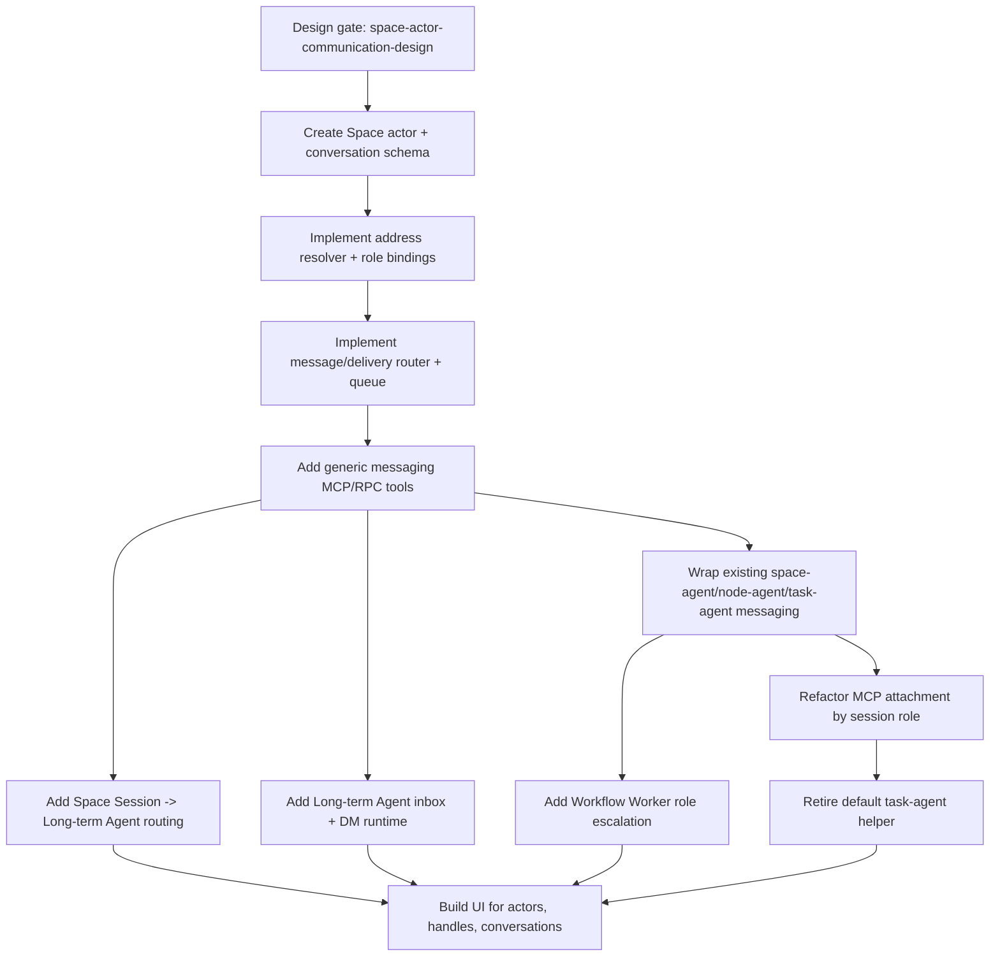

# Space Actor Communication Design

Status: Proposed
Date: 2026-05-16
Task: #401 — Design universal Space actor communication model

## Summary

Space communication should use one actor-addressed substrate for humans, the Coordinator,
Space Sessions, Long-term Agents, Workflow Workers, and System actors. The model is intentionally
Slack/Teams-like: stable actor IDs, readable handles, address resolution, conversations, threads,
delivery state, membership, permissions, and audit logs are first-class data instead of tool-specific
routing hacks.

This design replaces hardcoded paths such as `send_message_to_task`, workflow-only
`node-agent send_message`, task-agent queues, and broad `space-agent-tools` attachment rules with a
single Space Messaging layer. Existing MCP tools become compatibility wrappers over that layer while
UI and agents migrate to generic tools.

## Goals

- One universal actor-to-actor communication model inside a Space.
- Support DMs, group DMs, channel/topic conversations, and Space Session conversations, with
  task/workflow context captured as audit metadata and future timeline views.
- Stable internal actor IDs plus human-readable handles such as `@coordinator`, `@task-manager`,
  `#deployments`.
- Role-based addressing where a role can resolve to one actor now, many actors later, or a fallback.
- Space Session/ad-hoc chat can message Long-term Agents.
- Long-term Agents can message each other.
- Workflow Workers can escalate questions or blocked states to role agents such as
  `@role:task-manager` or `@coordinator`.
- Preserve auditability, permissions, autonomy boundaries, loop prevention, delivery state, retry
  state, and read/handled state.

## Existing concept mapping

| Current concept | New name | Notes |
| --- | --- | --- |
| Space Agent / default space chat agent | Coordinator | Long-term Agent with reserved role `coordinator` and handle `@coordinator`. |
| Human user in Space UI | Human Actor | Actor type `human`, can own sessions and approve restricted actions. |
| Space chat / ad-hoc Space session | Space Session | Actor type `space_session`, handle optional, session conversation participant. |
| New persistent role agents | Long-term Agent | Actor type `long_term_agent`, e.g. `@task-manager`, `@marketing-director`. |
| Workflow node agent / coder / reviewer | Workflow Worker | Actor type `workflow_worker`, scoped to workflow run/node. |
| Runtime, scheduler, gate scripts | System Actor | Actor type `system`, emits events and delivery records. |
| `space-agent-tools` | Space Messaging tools + Space management tools | Messaging part becomes generic substrate tools. |
| `node-agent send_message` | Wrapper for `send_message` | Adds workflow actor identity and topology checks. |
| `send_message_to_task` | Wrapper targeting task-bound worker agents or role agents | Deprecated after generic actor addressing exists. |
| `pending_agent_messages` | Delivery queue | Evolves into per-recipient delivery rows. |
| `space_task_agent` helper | Legacy Task Agent | Superseded by Coordinator/Task Manager routing plus worker direct delivery. |

Relevant current implementation anchors:

- `packages/daemon/src/lib/space/tools/space-agent-tools.ts` exposes `send_message_to_task` and owns
  broad Space tool wiring.
- `packages/daemon/src/lib/space/tools/node-agent-tools.ts` exposes workflow `send_message`.
- `packages/daemon/src/lib/space/runtime/agent-message-router.ts` resolves and delivers workflow
  worker messages.
- `packages/daemon/src/storage/repositories/pending-agent-message-repository.ts` stores queued
  workflow messages with retry/TTL state.
- `packages/daemon/src/lib/rpc-handlers/space-task-message-handlers.ts` routes human task messages
  to node agents and pending queues.
- `packages/daemon/src/lib/space/runtime/space-runtime-service.ts` attaches `space-agent-tools` to
  Space member sessions and special-cases `space_chat`, `space_task_agent`, and workflow sub-session
  IDs.
- `packages/daemon/src/lib/space/runtime/task-agent-manager.ts` creates task-agent and node-agent
  MCP servers and flushes pending messages.

## Actor taxonomy

Actors are Space-scoped addressable identities. Sessions are runtime incarnations of actors, not the
identity itself.

```ts
type SpaceActorType =
	| 'human'
	| 'coordinator'
	| 'space_session'
	| 'long_term_agent'
	| 'workflow_worker'
	| 'system';

type SpaceActorStatus = 'active' | 'idle' | 'disabled' | 'archived' | 'deleted';
```

`archived` means the actor no longer participates in routing but remains visible in conversation,
delivery, and audit history. `deleted` is a stronger soft-delete marker for privacy/admin removal:
routing, handle lookup, autocomplete, and new membership all ignore it, while historical messages and
delivery rows keep the actor ID with redacted display metadata rather than being physically removed.

### Human Actor

- Represents a user account/member in a Space.
- Stable actor ID: `actor_human_<spaceId>_<userId>`.
- Handles: `@alice`, display name, optional aliases.
- Can send user-authored messages, approve restricted actions, configure membership, and receive
  notifications.

### Coordinator

- Reserved Long-term Agent for each Space.
- Stable actor ID: `actor_agent_<spaceId>_coordinator`.
- Handle: `@coordinator`.
- Default fallback for unresolved role escalations unless configured otherwise.
- Replaces current default Space Agent naming in new UI/API language.

### Space Session / ad-hoc chat

- Ephemeral or persistent session actor representing a human-facing Space chat or ad-hoc session.
- Stable actor ID derives from session ID: `actor_session_<spaceId>_<sessionId>`.
- Optional handle: `@session-<shortId>` for internal references; UI displays session title.
- Can send messages to Long-term Agents, channels, and addressed Workflow Workers if session policy allows.
- Receives replies in the originating session conversation by default.

### Long-term Agent

- Persistent Space role agent, e.g. `@task-manager`, `@marketing-director`, `@sales-manager`,
  `@infra-director`.
- Stable actor ID: `actor_agent_<spaceId>_<agentId>`.
- Has handle, display name, role bindings, inbox, memory, tools, autonomy level, and acting policy.
- Can message Humans, Coordinator, other Long-term Agents, Space Sessions, Workflow Workers, and
  channels subject to policy.

### Workflow Worker

- Runtime actor for workflow node execution: Coding, Review, deploy checker, gate evaluator, etc.
- Stable actor ID within a run/node/session:
  `actor_worker_<spaceId>_<taskId>_<workflowRunId>_<nodeId>_<agentName>`.
- Worker aliases such as `@coder` and `@review` are contextual-only and are not registered as
  Space-global handles. Globally addressable worker handles must include workflow/run scope, e.g.
  `@worker:f1089/Review` or another collision-free namespace.
- Can send direct messages, escalate to roles, post to allowed channels, and receive direct feedback.
- Actor may become inactive when run ends; audit records remain.

### System Actor

- Non-human runtime source for scheduler, gates, CI poller, GitHub webhook, task lifecycle, or
  delivery daemon events.
- Stable actor IDs per subsystem, e.g. `actor_system_<spaceId>_workflow-runtime`.
- Can emit events and notifications; cannot perform user-like tool actions unless explicitly
  delegated by policy.

## Address syntax and resolution rules

Address resolution is a pure service with audit logging. It converts user/tool input into actor,
conversation, or thread targets before delivery.

### Syntax

| Syntax | Target kind | Example | Notes |
| --- | --- | --- | --- |
| `@handle` | Actor handle | `@coordinator`, `@task-manager` | Unique within Space among active actor handles. |
| `@role:<role>` | Role binding | `@role:task-manager` | Can resolve to one or many actors. |
| `@session:<id>` | Space Session actor | `@session:abc123` | Allows ad-hoc session addressing. |
| `@worker:<node>` | Workflow Worker in current run | `@worker:Review` | Contextual; requires task/workflow context. |
| `@worker:<run>/<node>` | Workflow Worker by run | `@worker:f1089/Review` | Stable across tools and UI. |
| `#channel` | Channel conversation | `#deployments` | Posts to channel. |
| `task:<number>` | Task context | `task:401` | Resolves task context for delivery to addressed actors; not a chat target in the initial model. |
| `workflow:<runId>` | Workflow context | `workflow:f1089...` | Resolves workflow run context for worker addressing/audit; not a chat target in the initial model. |
| `session:<id>` | Session conversation | `session:abc123` | Posts to session conversation. |
| `conversation:<id>` | Existing conversation | `conversation:conv_...` | Explicit continuation. |

### Resolution order

1. Parse explicit target syntax.
2. Resolve conversation/thread IDs before actor handles if prefix exists.
3. Resolve exact active actor handle in Space.
4. Resolve role binding in Space.
5. Resolve contextual worker aliases from sender context (`@review`, `@coder`, `Review`).
6. Resolve channel handle.
7. If no match, use configured fallback for sender context.
8. If fallback unavailable, create undeliverable delivery rows and notify sender.

### Handles

- Handle registry is Space-scoped and case-insensitive.
- Handles use lowercase kebab-case: `@task-manager`, `@infra-director`, `#deployments`.
- Reserved handles: `@coordinator`, `@system`, `@human`, `@me`, `@here`, `@channel`.
- Archived actors keep historical handle claims for audit but can release handle for reuse only after
  migration creates aliases.

### Roles

Role bindings decouple intent from concrete agents.

```ts
type SpaceRoleBinding = {
	role: string; // task-manager, infra, sales, coordinator
	strategy: 'single' | 'broadcast' | 'round_robin' | 'least_busy' | 'fallback_only';
	actorIds: string[];
	fallbackAddress?: string; // usually @coordinator or #triage
	requiresHumanApproval?: boolean;
};
```

Examples:

- `@task-manager` is a concrete actor handle when a single Task Manager agent owns that handle.
- `@role:task-manager` uses role-binding strategy and can resolve to one actor, many actors,
  round-robin/least-busy selection, or fallback.
- If no task manager role binding exists, fallback routes to `@coordinator` and records
  `resolution.fallbackUsed=true`.
- Workflow Worker blocked-state escalation defaults to `@role:task-manager`, fallback
  `@coordinator`, fallback channel `#workflow-triage` if the Coordinator is unavailable.

## Conversation types

Conversations are durable containers for LLM-visible message flows. Threads are ordered message trees
within conversations. A conversation can have one root thread and many topic/subthreads.

```ts
type SpaceConversationType = 'direct_message' | 'group_dm' | 'channel' | 'session_conversation';
```

Task and workflow are not conversation types in the initial model. Today they are nearly the same
routing context: messages are delivered directly to worker agents or Task Agent/Space Agent sessions,
while task/workflow IDs provide scope for authorization, queueing, activation, audit, and UI feeds.
Future task/workflow timelines are covered in Future considerations.

### Direct Message

- One sender, one target actor.
- Stable pair key: sorted participant actor IDs plus Space ID, unless `ephemeral=true`.
- Used for Long-term Agent ↔ Long-term Agent, Workflow Worker ↔ Long-term Agent escalation, and Space
  Session ↔ Long-term Agent private messages.

### Group DM

- Small fixed participant set.
- Used for ad-hoc coordination among humans and agents.
- Membership change can either mutate same conversation or fork, depending on audit policy.

### Channel

- Named Space-wide topic conversation, e.g. `#deployments`, `#sales`, `#workflow-triage`.
- Membership/subscriptions determine visibility and notifications.
- Supports mentions, channel-wide notifications, and topic threads.

### Session conversation

- Conversation bound to a Space Session/ad-hoc chat session ID.
- Default place for replies to messages originating from that session.
- Lets Long-term Agents answer back into human-visible ad-hoc session without targeting raw SDK
  session internals.

## Message schema

Messages are immutable content records. Edits/deletes are events linked to the original message.
Delivery, read, and handled state live in separate tables.

```ts
type SpaceMessage = {
	id: string;
	spaceId: string;
	conversationId: string;
	threadId: string;
	parentMessageId?: string;

	senderActorId: string;
	senderSessionId?: string;
	senderRunId?: string;
	senderTaskId?: string;

	body: string;
	format: 'text' | 'markdown' | 'json' | 'system_event';
	messageKind:
		| 'chat'
		| 'question'
		| 'answer'
		| 'blocked'
		| 'handoff'
		| 'approval_request'
		| 'approval_result'
		| 'system_event';

	explicitTargets: SpaceAddress[];
	resolvedTargets: ResolvedTarget[];
	mentions: SpaceMention[];
	attachments: SpaceAttachment[];
	artifacts: SpaceArtifactRef[];
	/** Structured machine payload used by workflow gates, votes, approvals, and system events. */
	data?: Record<string, unknown>;

	correlationId?: string;
	idempotencyKey?: string;
	replyToMessageId?: string;
	replyRouting?: ReplyRouting;

	createdAt: number;
	createdByActorId: string;
	visibility: 'conversation' | 'participants' | 'private' | 'audit_only';
	metadata?: Record<string, unknown>;
};
```

### Mentions

```ts
type SpaceMention = {
	range?: { start: number; end: number };
	address: string;
	resolvedKind: 'actor' | 'role' | 'channel' | 'conversation' | 'unknown';
	resolvedActorIds?: string[];
	resolvedConversationId?: string;
	fallbackUsed?: boolean;
};
```

### Attachments and artifacts

```ts
type SpaceAttachment = {
	id: string;
	type: 'file' | 'image' | 'url' | 'code' | 'diff' | 'github_pr' | 'github_comment';
	name?: string;
	url?: string;
	mimeType?: string;
	storageKey?: string;
	metadata?: Record<string, unknown>;
};

type SpaceArtifactRef = {
	artifactId: string;
	workflowRunId?: string;
	taskId?: string;
	nodeId?: string;
	type?: string;
	key?: string;
};
```

### Reply routing

```ts
type ReplyRouting = {
	mode: 'same_thread' | 'sender_dm' | 'origin_session_conversation' | 'channel';
	originMessageId?: string;
	originConversationId?: string;
	originThreadId?: string;
	originActorId?: string;
	originSessionId?: string;
};
```

Default rules:

- Reply to a message in a thread stays in same thread.
- Reply to a DM stays in the DM.
- Reply to a Space Session-originated escalation defaults to `origin_session_conversation` unless
  sender chooses another visible conversation.
- Workflow Worker replies go to the addressed sender/session by default; task/workflow IDs are kept
  as audit and authorization context, not as LLM-visible chat threads.

## Delivery schema

Each message creates one or more delivery rows. Delivery rows model target lifecycle, retries, and
read/handled state per recipient actor or conversation subscription.

```ts
type SpaceMessageDelivery = {
	id: string;
	messageId: string;
	spaceId: string;
	targetKind: 'actor' | 'conversation' | 'role' | 'channel_subscription';
	targetAddress?: string;
	resolvedActorId?: string;
	resolvedConversationId?: string;
	resolutionStrategy?: string;
	fallbackUsed?: boolean;

	status:
		| 'pending'
		| 'queued'
		| 'activating'
		| 'delivered'
		| 'read'
		| 'handled'
		| 'skipped'
		| 'failed'
		| 'expired'
		| 'cancelled';

	attemptCount: number;
	maxAttempts: number;
	nextAttemptAt?: number;
	lastAttemptAt?: number;
	deliveredAt?: number;
	readAt?: number;
	handledAt?: number;
	handledByActorId?: string;
	expiresAt?: number;

	errorCode?: string;
	errorMessage?: string;
	lastDeliverySessionId?: string;
	createdAt: number;
	updatedAt: number;
};
```

Delivery status semantics:

- `pending`: accepted, not yet processed by router.
- `queued`: waiting for inactive actor/session or scheduled retry.
- `activating`: runtime is starting target actor/session.
- `delivered`: message injected into target inbox/session or visible in subscribed conversation.
- `read`: human or agent read cursor passed message.
- `handled`: recipient acknowledged or acted on message.
- `skipped`: policy/routing intentionally suppressed delivery, e.g. sender not notified by own
  channel post.
- `failed`: retryable or terminal failure with error metadata.
- `expired`: TTL exceeded.
- `cancelled`: upstream task/run/conversation cancelled.

Existing `pending_agent_messages` maps legacy `pending` rows to deliverable `queued` delivery rows;
legacy `delivered`, `failed`, and `expired` rows map to historical delivery rows with matching terminal
state. Preserve `attemptCount`, `maxAttempts`, `expiresAt`, `lastError`, and `deliveredSessionId` so
queued/retryable messages survive cutover.

## Membership and subscription model

Membership answers who can see a conversation. Subscription answers who gets notified or activated.

```ts
type ConversationMembership = {
	conversationId: string;
	actorId: string;
	role: 'owner' | 'admin' | 'member' | 'guest' | 'observer';
	state: 'active' | 'muted' | 'left' | 'removed';
	joinedAt: number;
	lastReadMessageId?: string;
};

type ConversationSubscription = {
	conversationId: string;
	actorId: string;
	notificationLevel: 'all' | 'mentions' | 'direct' | 'none';
	autoActivate: boolean;
	eventFilters?: string[]; // task.blocked, workflow.review_ready, artifact.created
	createdAt: number;
};
```

### Channel membership

- Public Space channel: visible to all Space members; posting can be restricted by policy.
- Private channel: explicit members only.
- System channel: runtime-managed; may be read-only for humans/agents.
- Agents can be members with `notificationLevel='mentions'` by default to avoid noisy activation.

### Agent inboxes

Each actor has a virtual inbox, not a separate conversation type:

- DM deliveries.
- Mentions in DMs, channels, and session conversations; task/workflow context can raise priority.
- Subscribed event deliveries.
- Approval requests and blocked states.

Agent runtime consumes inbox rows by priority and policy. Inboxes use delivery rows plus actor cursors.

### Task/workflow event subscriptions

Long-term Agents can subscribe to structured events:

- Task Manager: `task.created`, `task.blocked`, `task.review_requested`, `task.overdue`.
- Infra Director: `workflow.deploy_failed`, `ci.failed`, `environment.blocked`.
- Coordinator: all high-priority task/workflow escalations by default.
- Humans: direct mentions, approval requests, watched tasks/channels.

## Routing semantics

### One-to-one

- Sender targets one actor handle or actor ID.
- Router creates or finds DM conversation if no conversation supplied.
- One delivery row is created for target actor.
- If target inactive and auto-activation allowed, status transitions `queued -> activating -> delivered`.

### One-to-many

- Sender targets channel, group DM, role broadcast, or multiple explicit targets.
- Router expands to actor recipients and conversation membership.
- Idempotency key prevents duplicate delivery when same actor appears through multiple target paths.
- Message stores original address plus resolved targets for audit.

### Role resolution

- Role strategy decides expansion.
- `single`: exactly one primary actor; fallback if missing.
- `broadcast`: all bound actors receive deliveries.
- `round_robin`: one actor selected, recorded in resolution metadata.
- `least_busy`: actor selected by queue depth or active task count.
- `fallback_only`: role is virtual; always routes to configured fallback.

### Missing target fallback

Fallback order:

1. Target-specific fallback from role binding or channel config.
2. Sender-context fallback, e.g. Workflow Worker blocked escalation → `@role:task-manager` →
   `@coordinator` → `#workflow-triage`.
3. Space default fallback `@coordinator`.
4. System undeliverable notice to sender and audit log.

Fallback use must be visible in message metadata and UI badges.

### Reply routing and thread continuity

- Every conversational message carries `conversationId` and `threadId`; replies default to both.
- Cross-conversation handoff stores `replyRouting.origin*` metadata.
- Space Session → Long-term Agent message creates a DM or channel post but records origin session
  conversation; agent response can return to the session conversation.
- Workflow Worker → Long-term Agent escalation records task/workflow run/node context and delivers as
  an addressed message. Response returns to the worker sender, origin session conversation, DM, or
  chosen channel according to routing metadata; task/workflow timelines only receive audit copies if
  implemented later.

### Ad-hoc Space Session to Long-term Agent

Flow:

1. User chats in a Space Session and mentions `@role:task-manager` or calls `send_message` with a
   role target.
2. Session actor posts a message in its session conversation with explicit target.
3. Resolver maps `@role:task-manager` to Long-term Agent actor ID(s) or fallback.
4. Router creates delivery to agent inbox and optional DM conversation link.
5. Agent runtime reads message, with origin session context and allowed reply route.
6. Agent reply posts to session conversation by default so the user sees it in the ad-hoc chat.

### Long-term Agent to Long-term Agent

Flow:

1. Agent calls `send_message({ target: '@infra-director', body })`.
2. Policy checks sender autonomy, recipient access, loop limits, and tool permissions.
3. Router creates/fetches DM conversation for both agents.
4. Delivery row activates target agent if allowed; otherwise queues.
5. Recipient handles and can reply in same DM thread.

### Workflow Worker escalation to role agent

Flow:

1. Worker reaches blocked state and calls
   `send_message({ target: '@role:task-manager', body: '<blocked details>', messageKind: 'blocked' })`.
2. Resolver expands role; if missing, fallback to `@coordinator`; if unavailable, fallback to
   `#workflow-triage`.
3. Router preserves workflow run, task, node, and sender context on the message/delivery rows.
4. Delivery row notifies resolved Long-term Agent/Coordinator inbox.
5. Agent response returns to the target worker or origin session/channel, preserving audit metadata.
6. If response includes action beyond worker autonomy, approval gate remains enforced.

## Permissions and autonomy

Permissions are evaluated before delivery, before activation, and before actions triggered by
messages.

### Permission checks

- Space membership: sender belongs to Space or is trusted System actor.
- Conversation membership/visibility: sender can post in target conversation.
- Addressability: sender can DM target actor type.
- Role policy: sender can invoke role binding.
- Activation policy: sender/message kind can activate sleeping agent.
- Autonomy policy: recipient can act on message without human approval.
- Tool policy: recipient tools available for requested action.
- Workflow topology policy: workers can message only permitted peers unless escalating to allowed
  roles/channels.

### Suggested defaults

| Sender | Can message | Default limits |
| --- | --- | --- |
| Human | Any Space actor/channel/task/session visible to them | Restricted only by Space permissions. |
| Coordinator | Long-term Agents, Humans, Space Sessions, Workflow Workers, channels | Must honor configured autonomy for external side effects. |
| Space Session | Coordinator, role agents, channels, session conversations | Cannot directly control workflow workers unless task context grants it. |
| Long-term Agent | Coordinator, other Long-term Agents, subscribed channels/tasks/workflows | External side effects gated by autonomy level. |
| Workflow Worker | Workflow peers, Coordinator, allowed roles, allowed channels | Cross-Space and unrelated task DMs denied. |
| System | System channels, task/workflow events, configured recipients | Cannot impersonate human/agent. |

### Human approval boundaries

Messages can request actions but cannot bypass gates:

- Low-autonomy agents may draft plans/replies but need human approval for changes.
- Workflow Workers remain bound by workflow gates such as PR-ready, review approval, merge policy.
- Role agents may advise or triage blocked workers; they cannot grant permission beyond their own
  configured authority.
- Approval requests are message kind `approval_request` with explicit action metadata and delivery to
  Human/Coordinator according to policy.

### Audit log needs

Audit entries should capture:

- Sender actor/session/user and effective identity.
- Raw target address, resolved target, role strategy, fallback use.
- Permission decisions and policy version.
- Message content hash, attachment/artifact refs, visibility.
- Delivery attempts, activation attempts, failures, retries.
- Read/handled acknowledgements for agents and humans.
- Actions taken as result of message, linked by correlation ID.

## Loop prevention

Agent-to-agent communication must default safe. The substrate should prevent runaway ping-pong,
broadcast storms, and self-trigger loops.

### Limits

- Per-conversation agent turn limit, e.g. 12 agent-authored replies in 10 minutes without human or
  System event interruption.
- Per-actor outbound rate limit per Space and per target.
- Per-role broadcast fanout limit.
- Max reply depth for automatic agent responses.
- Max retry attempts and TTL for queued delivery.
- Cooldown for repeated identical messages using content hash + target + thread.

### Cycle detection

Track recent chain metadata:

```ts
type MessageLoopTrace = {
	rootMessageId: string;
	conversationId: string;
	actorPath: string[];
	rolePath: string[];
	messageHashPath: string[];
	startedAt: number;
};
```

Detect:

- A → B → A ping-pong above threshold.
- Role fallback cycle, e.g. `@role:task-manager` fallback `@coordinator`, Coordinator policy forwards
  back to `@role:task-manager`.
- Channel mention loops where agent responds with same channel mention repeatedly.
- Delivery retry loop caused by activation failure.

### Escalation

When loop guard trips:

1. Stop auto-activation for affected thread.
2. Mark delivery `failed` or `skipped` with `errorCode='loop_guard'`.
3. Post System summary to thread.
4. Notify `@coordinator` or Human depending on severity.
5. Require manual reply or explicit resume to continue.

## MCP/API shape

Expose one generic Space Messaging API to agents, UI, and runtime services. MCP tools are thin
wrappers over the same service.

### Core tools

#### `send_message`

```ts
type SendMessageInput = {
	target: string | string[];
	body: string;
	conversationId?: string;
	threadId?: string;
	messageKind?: SpaceMessage['messageKind'];
	attachments?: SpaceAttachment[];
	artifacts?: SpaceArtifactRef[];
	/** Structured payload preserved for workflow gates, votes, approvals, and system events. */
	data?: Record<string, unknown>;
	idempotencyKey?: string;
	replyToMessageId?: string;
	visibility?: SpaceMessage['visibility'];
};
```

`data` is not user-visible prose. It is a first-class structured payload attached to the message and
available to routing adapters. `node-agent-tools.send_message` maps existing `data` directly into this
field so gated channel writes can still merge payloads into gate state and unblock downstream nodes.
Returns:

```ts
type SendMessageResult = {
	messageId: string;
	conversationId: string;
	threadId: string;
	resolvedTargets: ResolvedTarget[];
	deliveries: { deliveryId: string; targetActorId?: string; status: string }[];
	fallbacksUsed: string[];
};
```

#### `list_actors`

Filters actors by type, handle, role, status, capability, task, workflow run, or channel.

#### `resolve_address`

Returns parsed address, candidate actors/conversations, fallback decision, and permission result
without sending a message. Used by UI autocomplete and agent planning.

#### `list_conversations`

Lists visible conversations for caller with type filters, unread counts, and membership state.

#### `read_conversation`

Reads messages by conversation/thread with cursor pagination. Can optionally mark read for caller.

#### `ack_message` / `mark_handled`

Marks delivery as read/handled with optional note/action reference.

#### `subscribe_conversation` / `update_notification_level`

Manages membership/subscription when policy allows.

### RPC endpoints

UI-facing RPC mirrors MCP:

- `space.messaging.sendMessage`
- `space.messaging.resolveAddress`
- `space.messaging.listActors`
- `space.messaging.listConversations`
- `space.messaging.readConversation`
- `space.messaging.markRead`
- `space.messaging.markHandled`
- `space.messaging.updateSubscription`

### Legacy wrapper strategy

Keep existing tools while migrating callers:

- `space-agent-tools.send_message_to_task` → calls `send_message` with task context and current
  compatibility semantics. If caller provides only `task_id`/`task_number`, default delivery remains
  the task-agent/legacy task coordinator actor for that task. If caller provides `node_id` or explicit
  actor/role target, route to that worker/role. Mark deprecated in tool description.
- `node-agent-tools.send_message` → calls `send_message` with sender actor type `workflow_worker`,
  sender workflow context, and topology/autonomy policy. Preserve current gated channel behavior by
  converting workflow topology to permissions plus role/channel destinations.
- `task-agent-tools.send_message` → if Task Agent remains during migration, maps to addressed worker
  delivery, role delivery, or Coordinator DM. If task-agent helper is removed, wrapper returns
  migration guidance or routes from `system`/`coordinator` according to compatibility mode.
- `PendingAgentMessageRepository` → becomes compatibility facade over `space_message_deliveries`.
- `SpaceRuntimeService.attachSpaceToolsToMemberSession` → uses actor/session role resolver to attach
  generic messaging MCP plus only role-appropriate management/query tools.

Tool descriptions should stop teaching agents special one-off names once generic tools exist.

## Migration plan

### Phase 0: Design gate

- Land this design artifact.
- Update or supersede draft tasks #398, #399, and #400 as below.

### Phase 1: Data model foundation

Add tables/repositories for:

- `space_actors`
- `space_actor_handles`
- `space_role_bindings`
- `space_conversations`
- `space_conversation_memberships`
- `space_conversation_subscriptions`
- `space_messages`
- `space_message_deliveries`
- `space_message_audit_events`

Seed actors from existing data:

- Human actors from Space membership/users.
- Coordinator from current Space Agent / `space_chat` default session.
- Space Session actors only from ad-hoc human/member sessions with `context.spaceId` and an allowed
  user-facing session type. Exclude `space_chat`, `space_task_agent`, and workflow sub-sessions; seed
  Coordinator and Legacy Task Agent actors through their dedicated migration paths so runtime sessions
  are not misclassified as user-facing Space Session actors.
- Workflow Worker actors from active and declared workflow node executions, including inactive workers
  referenced by `pending_agent_messages`, so queued/retryable deliveries keep resolvable recipients.
- System actors for runtime subsystems.

### Phase 2: Resolver and router service

Create `SpaceMessagingService` with:

- Actor registry.
- Address parser/resolver.
- Permission/autonomy checker.
- Conversation resolver plus task/workflow context resolver.
- Delivery writer and queue.
- Loop guard.
- Audit writer.

Adapt existing `AgentMessageRouter` behavior into this service or make it a workflow-specific
adapter. Preserve current activation and queue semantics.

### Phase 3: Generic MCP/RPC tools

Add generic MCP server/tool set:

- `send_message`
- `list_actors`
- `resolve_address`
- `list_conversations`
- `read_conversation`
- `mark_handled`

Add UI RPC endpoints for same primitives.

### Phase 4: Compatibility wrappers

Refactor wrappers:

- `space-agent-tools.send_message_to_task` delegates to Space Messaging.
- `node-agent-tools.send_message` delegates to Space Messaging.
- Human task message RPC resolves target worker/role actors and writes delivery rows instead of
  directly targeting hidden task-agent/node paths.
- Pending message queues map to delivery rows.

No user-visible behavior should regress during this phase.

### Phase 5: Role-based MCP attachment

Replace broad `context.spaceId` MCP attachment sweeps with an explicit session role → MCP policy:

| Session role | Messaging tools | Other tools |
| --- | --- | --- |
| Coordinator / Space chat | Generic messaging + Space management | db-query, registry tools if configured |
| Space Session / ad-hoc | Generic messaging | db-query if policy allows |
| Long-term Agent | Generic messaging | role tools, memory tools, allowed MCPs |
| Workflow Worker | Generic messaging via node wrapper | node workflow tools, safe registry/fetch tools |
| Legacy Task Agent | Compatibility tools only during migration | task-agent tools if retained |
| System | Internal service API, not SDK MCP by default | none |

Role-based attachment must also make MCP server names and tool names collision-safe. Current
`mergeRuntimeMcpServers` semantics overwrite on key collision, so generic messaging tool names must
not collide with role-specific management tools or compatibility wrappers.

This phase directly addresses current scattered `SpaceRuntimeService`, `TaskAgentManager`, rehydrate,
reset, and `QueryOptionsBuilder` ownership paths.

### Phase 6: Long-term Agent runtime

Implement persistent agents:

- Coordinator as reserved Long-term Agent.
- CRUD for role agents and handles.
- Agent inbox processing loop with activation policy.
- Role bindings and fallback config.
- UI surfaces for agent list, DM, channel membership, and subscriptions.

### Phase 7: Task-agent removal/retirement

Remove or retire default `space_task_agent` LLM helper after direct worker/role delivery and
Coordinator/Task Manager routing replace its orchestration role. Keep DB compatibility for existing
`taskAgentSessionId` rows.

## Proposed follow-up implementation tasks

Dependency graph:



### New tasks to create

1. **Add Space actor and conversation persistence**
   - Depends on this design.
   - Add schema/repositories/types and seed Coordinator/Human/Session/System actors.

2. **Implement Space address resolver and role bindings**
   - Depends on actor persistence.
   - Supports handles, roles, sessions, workers, channels, task/workflow context, and fallback.

3. **Implement Space message router and delivery queue**
   - Depends on resolver.
   - Replaces pending queue internals with delivery rows, retry/TTL, activation hooks, audit events,
     loop guard.

4. **Expose generic Space Messaging MCP/RPC tools**
   - Depends on router.
   - Adds `send_message`, `list_actors`, `resolve_address`, `list_conversations`,
     `read_conversation`, `mark_handled`.

5. **Migrate legacy messaging tools to Space Messaging wrappers**
   - Depends on generic tools.
   - Refactors `send_message_to_task`, node-agent `send_message`, task-agent `send_message`, and
     human task RPC to delegate to the new service.

6. **Implement Long-term Agent inbox and DM runtime**
   - Depends on generic tools.
   - Enables Long-term Agent ↔ Long-term Agent messaging and activation.

7. **Implement Space Session to Long-term Agent messaging**
   - Depends on generic tools.
   - Ensures ad-hoc sessions can send to role agents and receive replies in session conversations.

8. **Implement Workflow Worker role escalation**
   - Depends on legacy wrappers and resolver.
   - Supports blocked/question escalation to `@role:task-manager`, fallback `@coordinator`, and direct
     delivery back to worker/origin session with task/workflow audit context.

9. **Add actor/channel/conversation UI**
   - Depends on generic RPC and core runtime.
   - Adds handles, channels, DMs, session conversations, task/workflow delivery context badges, and
     notification settings.

### Existing draft task updates

#### #398 — Untangle Space MCP ownership by session role

Update rather than run as originally scoped. New scope should depend on generic messaging tools and
become **Refactor Space MCP attachment by actor/session role**.

Changes:

- Use explicit actor/session role resolver from this design.
- Attach generic Space Messaging MCP to Coordinator, Space Sessions, Long-term Agents, and Workflow
  Workers through role-appropriate wrappers.
- Keep db-query/registry/fetch tools separate from messaging tools.
- Replace all current skip mechanisms with actor/session-role policy: `session.type === 'space_chat'`,
  `session.type === 'space_task_agent'`, and workflow sub-session ID checks using `:task:` plus
  `:exec:`. Do not treat `:agent:` as a guard; it is part of workflow session ID construction.

Dependency: after tasks 1–5 above.

#### #399 — Fix Space ad-hoc session MCP reattach after daemon restart

Supersede as a standalone fix if generic role-based attachment is prioritized. If restart bug must be
fixed before the messaging migration, keep a short tactical task.

Recommended update:

- Short-term: ensure Space Session/ad-hoc sessions reattach current tools before first post-restart
  query.
- Long-term: replace with Phase 5 role-based attachment policy and regression tests that verify
  generic messaging tools are present.

Dependency: short-term can run now; long-term depends on #398 updated scope.

#### #400 — Remove built-in task-agent LLM helper from Space workflows

Update to depend on generic messaging wrappers and direct worker/role delivery. Removing the helper
before the substrate exists risks losing human task messages and worker escalation paths.

Recommended new scope:

- After direct worker/role delivery and workflow escalation work, retire default `space_task_agent`
  LLM helper.
- Preserve runtime services, workflow worker tools, pending delivery compatibility, and existing DB
  rows.
- Route human task messages to Coordinator, Task Manager, or explicit workers through Space
  Messaging; task/workflow IDs remain context/audit metadata.

Dependency: after tasks 1–5 and 8 above.

## Non-goals

- Implementing full Slack UI in the first backend migration.
- Cross-Space federation.
- External user invites and organization-wide directory.
- Replacing provider/session execution engine.
- Allowing messages to bypass workflow gates or human approval requirements.

## Future considerations: task and workflow timelines

Task and workflow should not become LLM chat threads in the initial messaging substrate. Today task
and workflow are mostly the same routing context: a task owns/links a workflow run, and messages go
directly to worker agents, the Task Agent, or the Space Agent. The future model should keep that
behavior for LLM delivery and add separate non-conversational history surfaces if needed.

Suggested names:

- **Task timeline**: task-scoped audit/feed view for human-visible questions, answers, status changes,
  artifacts, delivery summaries, and decisions. It can reference messages delivered to actors, but it
  should not be the message stream injected into an LLM by default.
- **Workflow execution log**: workflow-run-scoped event log for worker handoffs, gate writes, CI,
  activation, queued deliveries, retries, artifacts, and runtime/system events. It should support
  debugging and audit, not conversational turn-taking.

Rules for future timelines:

- LLMs receive addressed messages plus curated task/workflow context, not whole task/workflow logs.
- Direct worker/role/session delivery remains primary; task/workflow IDs stay as context and audit
  metadata on messages and delivery rows.
- Timeline entries can be projections/copies of messages, system events, and artifacts; they do not
  own reply routing.
- Replies return to the addressed actor, DM/channel, or origin session conversation unless a user
  explicitly starts a new conversation.

## Acceptance criteria mapping

- Avoid hardcoded agent-to-agent assumptions: actors, roles, resolver, conversations, deliveries, and
  wrappers replace one-off paths.
- Existing concepts mapped: see Existing concept mapping and Actor taxonomy.
- Space ad-hoc sessions send messages to Long-term Agents: see routing flow and session conversation model.
- Long-term Agents send/receive messages from each other: see DM flow and inbox model.
- Workflow Workers escalate to role agents: see blocked escalation flow and fallback rules.
- Dependency graph included: see follow-up implementation tasks.
