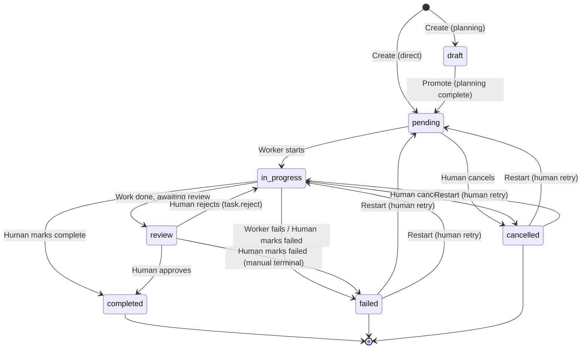
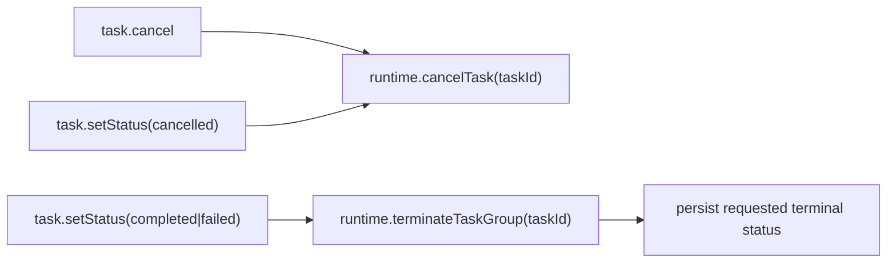

# Task Status Control Design

This document describes the design for human-in-the-loop task status control, allowing humans to have full manual control over the task lifecycle when needed, bypassing the normal autonomous flow.

## Status State Machine



## Valid Status Transitions

| Current Status | Allowed Target Statuses | Notes |
|----------------|------------------------|-------|
| `draft` | `pending` | Planning-created tasks, promoted when plan approved |
| `pending` | `in_progress`, `cancelled` | Worker not started yet |
| `in_progress` | `review`, `completed`, `failed`, `cancelled` | Worker is actively working |
| `review` | `completed`, `failed`, `in_progress` | Awaiting human approval |
| `completed` | _(none)_ | Terminal state - no transitions allowed |
| `failed` | `pending`, `in_progress` | Restart: human can retry failed task |
| `cancelled` | `pending`, `in_progress` | Restart: human can retry cancelled task |

## Session Group State (Current)

`session_groups.state` is retained for compatibility and uses:

- `awaiting_worker`
- `awaiting_leader`
- `awaiting_human`
- `completed`
- `failed`

`hibernated` is not part of the current model.

## Transition Behavior

### Validated via `setTaskStatus()`

All status transitions are validated against `VALID_STATUS_TRANSITIONS` before applying:

- **Validation**: Throws error if transition is not allowed
- **Restart clearing**: When moving from `failed`/`cancelled` to `pending`/`in_progress`:
  - Clears `error` field (sets to `null`)
  - Clears `result` field (sets to `null`)
  - Clears `progress` field (sets to `null`)
- **Completion**: When moving to `completed`:
  - Sets `progress` to `100`
  - Optionally sets `result` if provided
- **Failure**: When moving to `failed`:
  - Optionally sets `error` if provided

### Active Group Cancellation

When a task has an active session group (agents currently running) and transitions to a terminal state (`completed`, `failed`, `cancelled`), the system:

1. Looks up the active group for the task
2. For `cancelled`, calls `runtime.cancelTask(taskId)` (task cancel + group/session cleanup)
3. For `completed` or `failed`, calls `runtime.terminateTaskGroup(taskId)` (group/session cleanup only)
4. If runtime cleanup fails, throws an error
5. Only then applies (or returns) the final task status

For `task.cancel`, if runtime exists, the handler delegates directly to `runtime.cancelTask(taskId)`.



### Human Review RPCs

- **`task.approve`**: requires `review` status and resumes runtime with `approved=true`.
- **`task.reject`**: requires `review` status and resumes runtime with `approved=false` plus feedback.
- **`task.sendHumanMessage`**: direct human messaging to `worker` (default) or `leader` without state gating.

## API

### Room Agent MCP Tool

**`set_task_status`** - Validates and transitions task status

```typescript
// Tool definition
{
  name: 'set_task_status',
  description: 'Change task status with validation. Allows room agent to complete, fail, restart, or change status of any task.',
  inputSchema: {
    type: 'object',
    properties: {
      task_id: { type: 'string', description: 'Task ID to update' },
      status: {
        type: 'string',
        enum: ['draft', 'pending', 'in_progress', 'review', 'completed', 'failed', 'cancelled'],
        description: 'New status to set'
      },
      result: { type: 'string', description: 'Optional result message (for completed status)' },
      error: { type: 'string', description: 'Optional error message (for failed status)' }
    },
    required: ['task_id', 'status']
  }
}
```

### RPC Handler

**`task.setStatus`** - UI-initiated status change

```typescript
// Request
{
  roomId: string;
  taskId: string;
  status: TaskStatus;
  result?: string;
  error?: string;
}

// Response
{ task: NeoTask }
```

**`task.approve`** - Human approval while task is in `review`

```typescript
// Request
{
  roomId: string;
  taskId: string;
}

// Response
{ success: boolean }
```

**`task.reject`** - Human rejection while task is in `review`

```typescript
// Request
{
  roomId: string;
  taskId: string;
  feedback: string;
}

// Response
{ success: boolean }
```

### Events

**`room.task.update`** - Emitted after status change

```typescript
{
  sessionId: `room:${roomId}`,
  roomId: string,
  task: NeoTask
}
```

## Types

### UpdateTaskParams

```typescript
export interface UpdateTaskParams {
  title?: string;
  description?: string;
  status?: TaskStatus;
  priority?: TaskPriority;
  progress?: number | null;  // null clears the field
  currentStep?: string | null;
  result?: string | null;
  error?: string | null;
  dependsOn?: string[];
}
```

## Usage Examples

### Restart a Failed Task

```typescript
// Via Room Agent MCP tool
await set_task_status({
  task_id: 'task-123',
  status: 'pending'
});
// Result: error, result, progress fields cleared, task ready for worker pickup
```

### Complete a Task with Result

```typescript
// Via RPC handler
await hub.request('task.setStatus', {
  roomId: 'room-abc',
  taskId: 'task-123',
  status: 'completed',
  result: 'Feature implemented and tested'
});
// Result: progress=100, result set, task marked complete
```

### Cancel an In-Progress Task

```typescript
// Via Room Agent MCP tool
await set_task_status({
  task_id: 'task-123',
  status: 'cancelled'
});
// Result: active agents stopped, task marked cancelled
```
